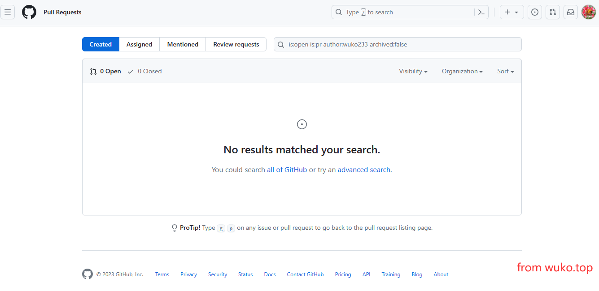
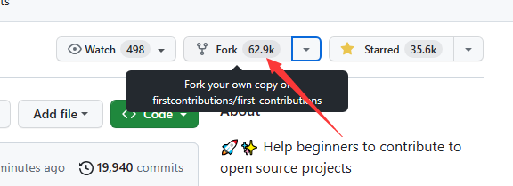
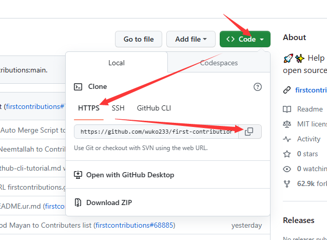
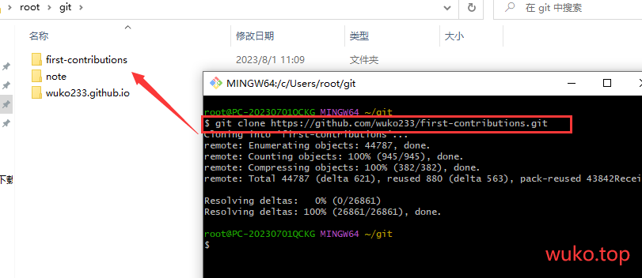
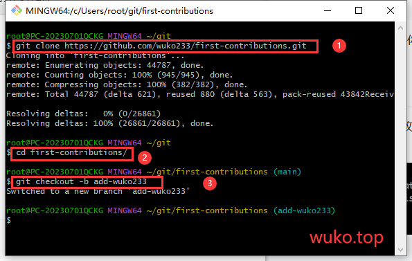
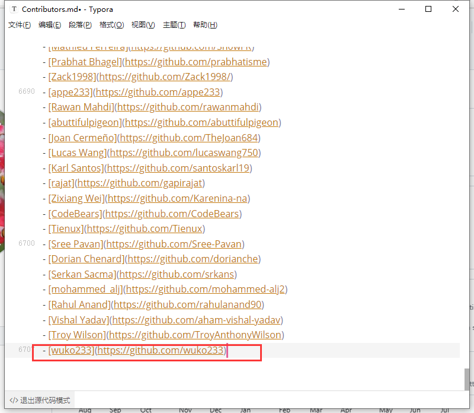
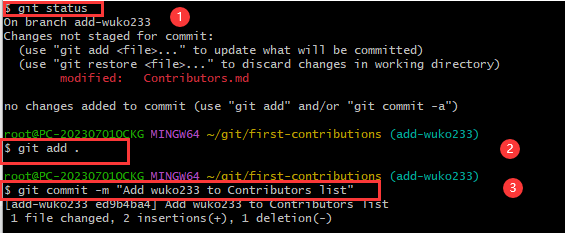
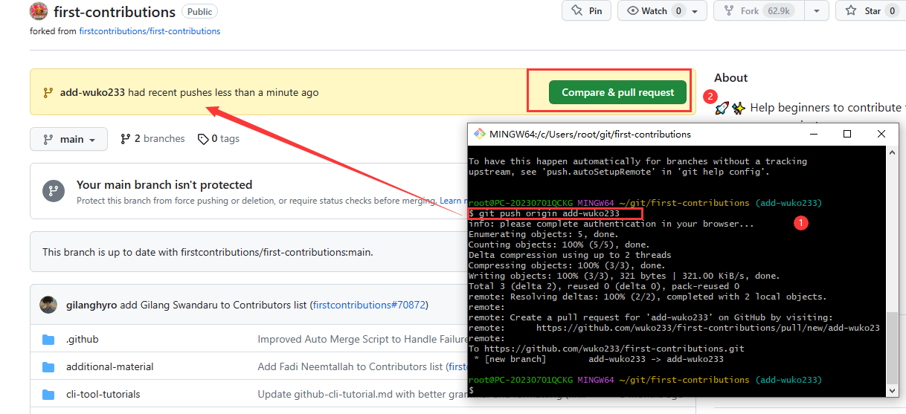
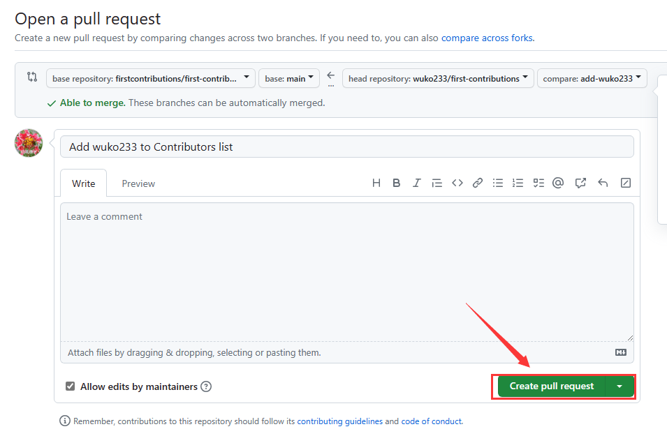
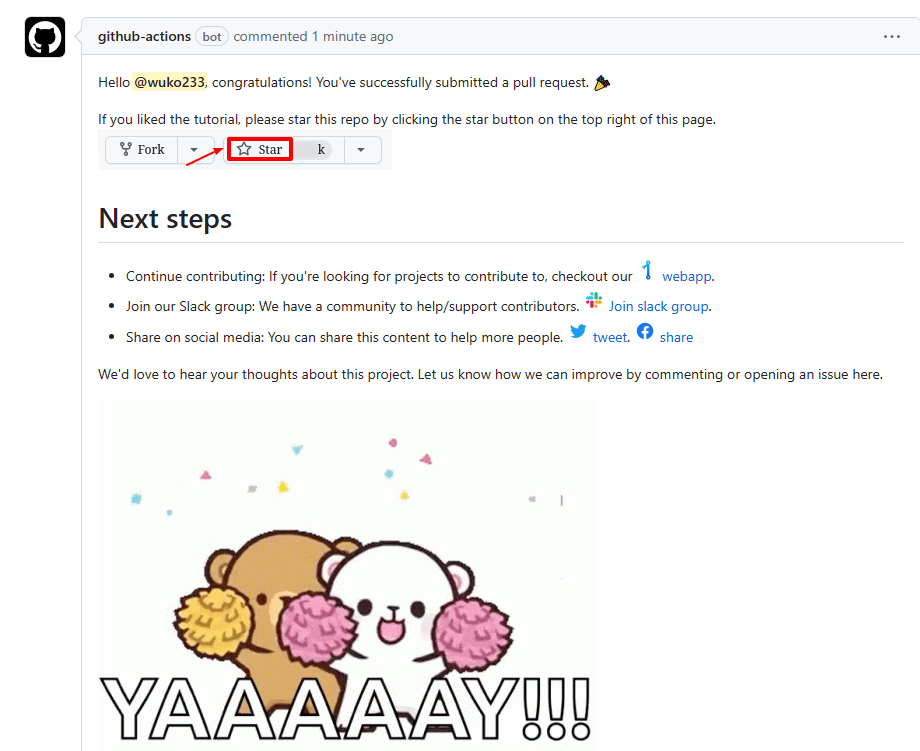

# 什么是pr?如何pr?一个面向小白的Github项目——first-contributions

## 前言

相信许多人在浏览Github时经常看到一个关键词：**pr** ，这并不是指Adobe开发的视频剪辑工具，而是指 **Pull Requests**，举个例子，你看到一个repo代码还有优化的空间，你就可以fork到你自己的仓库，改动后提交pr，原仓库主人会收到你的pr请求，如果他觉得你的写的不错，就会将你的分支合入到主分支，这就是pr，你可以在这里找到：[Github - Pull Requests](https://github.com/pulls)

相信许多像我一样的入门小白这个页面都是这样的：



那么，有没有办法来亲身体验一次pr的整个流程呢？这就是我们今天要了解的一个仓库：[first-contributions](https://github.com/firstcontributions/first-contributions)

该仓库也有中文文档：[zh-cn](https://github.com/firstcontributions/first-contributions/blob/main/translations/README.zh-cn.md)，可参考该文档。

在开始前，请确保你的设备能够使用 **git** 命令。

## 开始

### 1，Github建立分支仓库

登录你的GitHub账号，打开该仓库地址：[这里](https://github.com/firstcontributions/first-contributions)

点击 **Fork**



Fork之后转到你Fork的仓库，点击绿色的 **Code** 按钮，选择 HTTPS或SSH。

这里以https来举例：



点击 **Https** ，点击复制按钮或者自行复制。

### 2，克隆仓库并建立新分支

在任意位置打开命令行（这里用的是Git Bash）

【1】



````bash
 git clone [你复制的链接] 
````

在进度走到100%后，使用切换目录命令进入 **first-contributions** 。

【2】

Windows/Linux: 

````bash
cd first-contributions
````

【3】

创建并切换到一个新分支：

````bash
git checkout -b [分支名]
````

注：分支名建议以 **add-** 开头



### 3，添加自己到贡献者列表并推送

使用任意文本编辑器打开目录下的 **Contributors.md** 文件，建议使用支持Markdown格式的编辑器（如VS code），请勿使用word。

在末尾以MD格式填入你的名字和Github主页：

````markdown
- [名字](你的主页地址)
````

这会将你的名字与主页添加到贡献者列表。



【1】

使用 **git status** 查看当前状态：

````bash
git status
````

【2】

添加改动文件：

````bash
git add Contributors.md
````

这里偷懒用了 **.** ，即添加所有有改动的文件。

【3】

提交改动的文件：

````bash
git commit -m "Add [Yourname] to Contributors list"
````

记得把空改了。



### 4，推送，然后合并

【1】

推送你的修改到你的仓库，此时一个新分支在GitHub被创建：

````bash
git push origin add-[你自己的名字]
````

【2】

打开你克隆的仓库的主页，你会看到一个绿色的按钮 **Compare & pull request** 。



点击它，进入pr界面，此页面显示了一些相关的信息，默认无需更改。



点击 **Create pull request** ，将你的分支汇入主分支。

**恭喜你！现在你已经完成了一个pr！现在等待管理批准你的pr！**

此项目已启用bot来审核pr，所以如果你前面的步骤都ok，那么你很快就会从GitHub网页和Email收到成功通知；如果你的pr被驳回了，不要沮丧，检查你的每一步是否有错误。



## 尾声

对于刚入门的小白来讲，想要跨过从无到有这一步很困难，但只要坚持走下去，就会**复行数十步，豁然开朗**，共勉。


