## 签到

`flag{buu_ctf}`

## 金三胖

给定GIF文件，可以很明显看到flag文字，对文件进行拆解，在`20`、`50`与`78`帧找到flag：

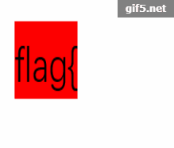 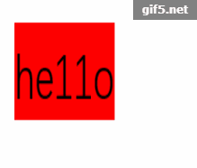 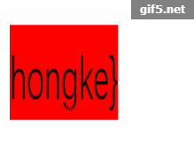

## 你竟然赶我走

查看文件元数据，末尾得到flag：

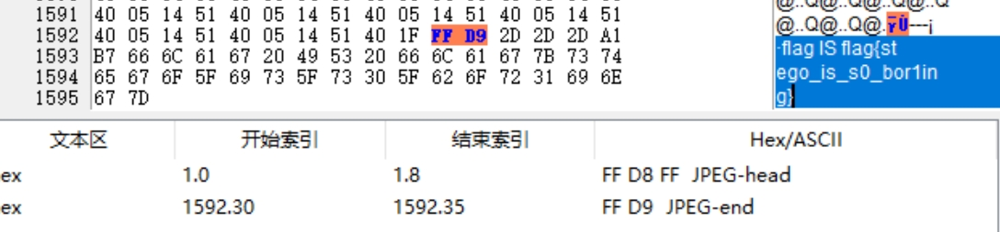

`flag{stego_is_s0_bor1ing}`

## 二维码


直接扫码得到flag...并没有，扫码得到：`secret is here`

十六进制分析，发现有zip文件，使用`binwalk`分离，发现有一个名为`4number.txt`加密文件，使用`APCHPR`秒了：

````
Advanced Archive Password Recovery 统计信息:
加密的 ZIP/RAR/ACE/ARJ 文件: D:\BUU\misc\二维码\_QR_code.png.extracted\1D7.zip
总计口令: 8,741
总计时间: 10ms 
平均速度(口令/秒): 874,100
这个文件的口令 : 7639
十六进制口令: 37 36 33 39 
````

得到`CTF{vjpw_wnoei}`

## 大白

修复图片长宽高，得到:`flag{He1l0_d4_ba1}`

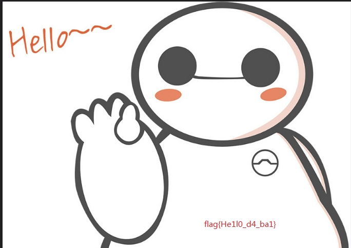

## 乌镇峰会种图

同[你居然赶我走](#你竟然赶我走)，查看文件元数据末尾得到flag：

`flag{97314e7864a8f62627b26f3f998c37f1}`

## wireshark

用`wireshark`打开，查找关键词找到password：

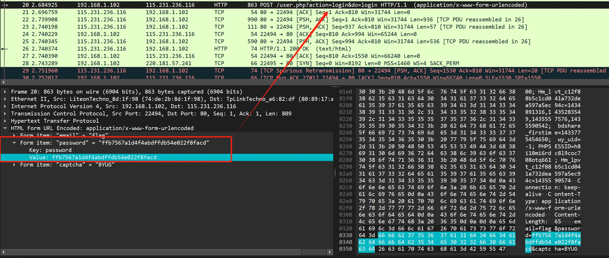

`flag{ffb7567a1d4f4abdffdb54e022f8facd}`

## N种方法解决

下载下来发现是`.exe`文件，直接运行失败，拖到`IDA pro`里查看，发现其开头为`data:image/jpg;base64`后跟一串base64，将它转换为图片：

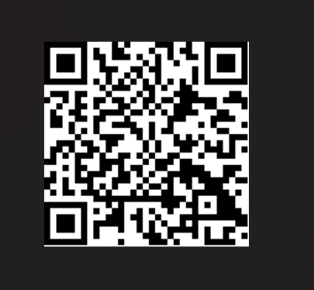

扫码得到：`KEY{dca57f966e4e4e31fd5b15417da63269}`

## 基础破解

> 给你一个压缩包，你并不能获得什么，因为他是四位数字加密的哈哈哈哈哈哈哈。。。不对= =我说了什么了不得的东西。。

使用`APCHPR`秒了：`2563`

解压得到flag.txt，内容`ZmxhZ3s3MDM1NDMwMGE1MTAwYmE3ODA2ODgwNTY2MWI5M2E1Y30=`

base64解码: `flag{70354300a5100ba78068805661b93a5c}`

## 文件中的秘密

下载，直接查看图片属性，得到flag：`flag{870c5a72806115cb5439345d8b014396}`

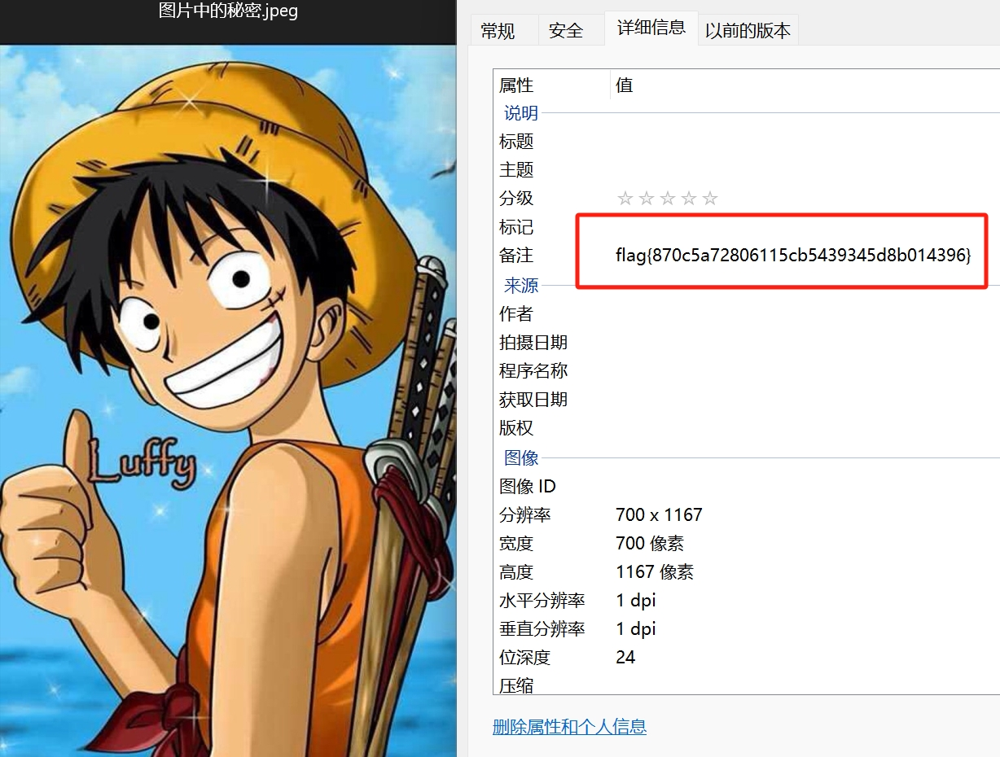

## zip伪加密

谜底出在谜面上，对它使用zip伪加密修复吧！

得到flag.txt:`flag{Adm1N-B2G-kU-SZIP}`

## LSB

使用`Stegsolve.jar`提取RGB通道数据，得到二维码：


扫描得到：`cumtctf{1sb_i4_s0_Ea4y}`

## 被嗅探的流量

`wireshark`打开，http分类，找到upload:

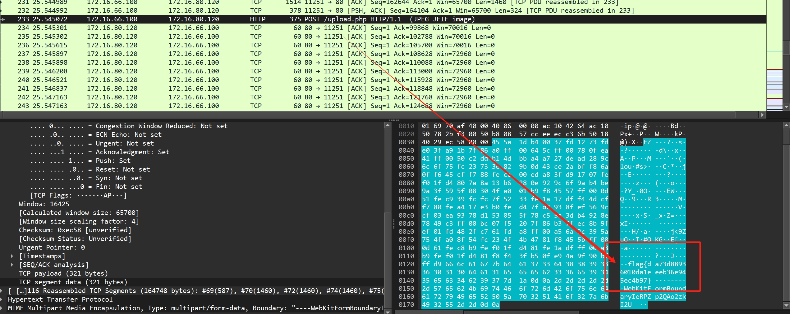

`flag{da73d88936010da1eeeb36e945ec4b97}`

## rar

已知密码是4位，使用`APCHPR`秒了：`8795`

解压得到：`flag{1773c5da790bd3caff38e3decd180eb7}`

## qr

扫码得到：`欢迎参加本次比赛，密码为 Flag{878865ce73370a4ce607d21ca01b5e59}`

## 镜子里面的世界

`Stegsolve.jar`打开提取数据：

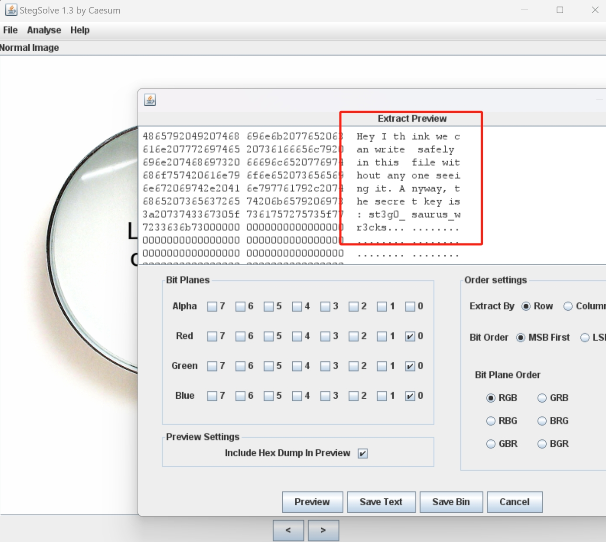

`Hey I think we can write safely in this file without any one seeing it. Anyway, the secret key is: st3g0_ saurus_wr3cks`

`flag{st3g0_saurus_wr3cks}`

## 爱因斯坦

查看图片16进制，好家伙，塞了一个zip，使用`binwalk`分离，得到一个加密的zip，`APCHPR`失败，继续寻找密码。。。图片exif找到：`this_is_not_password`，尝试，得到flag：`flag{dd22a92bf2cceb6c0cd0d6b83ff51606}`

## ningen

下载图片查看十六进制，发现还有其他文件，使用`foremost`提取出加密的zip，结合提示`秋明特别讨厌中国的六位银行密码，喜欢四位数`,`APCHPR`秒了:`8368`

`flag{b025fc9ca797a67d2103bfbc407a6d5f}`

## 小明的保险箱

和[ningen](#ningen)一样，`binwalk`分离得到rar文件，根据提示4位数，`APCHPR`秒了：`7869`

`flag{75a3d68bf071ee188c418ea6cf0bb043}`

## easycap

`wireshark`发现全是`TCP`，右键`追踪流`得到：

`FLAG:385b87afc8671dee07550290d16a8071`

## 隐藏的钥匙

查看图片元数据，找到文本：`flag:base64:(Mzc3Y2JhZGRhMWVjYTJmMmY3M2QzNjI3Nzc4MWYwMGE=).`

base64解码得到：`377cbadda1eca2f2f73d36277781f00a`

## 另外一个世界

图片查看元数据，结尾发现

`01101011011011110110010101101011011010100011001101110011`

判断为2进制，转换成文字为：`koekj3s`

## 数据包中的线索

`wireshark`追踪http流，得到一大串base64码，转换成图片：

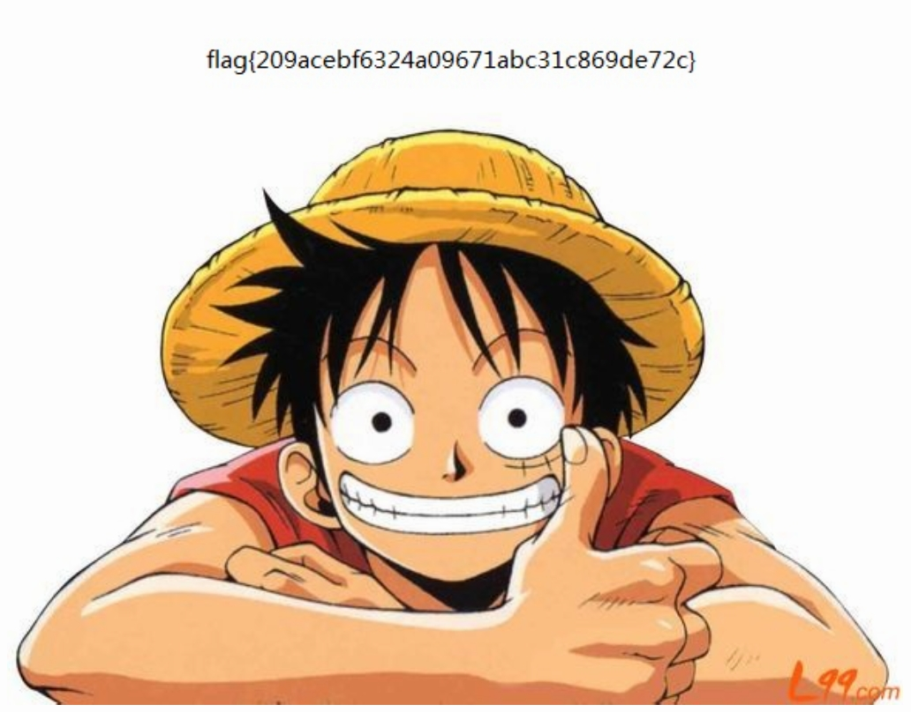

`flag{209acebf6324a09671abc31c869de72c}`

## 神秘龙卷风

根据提示4位数，`APCHPR`秒了：`5463`

解压打开一看，不是哥们：

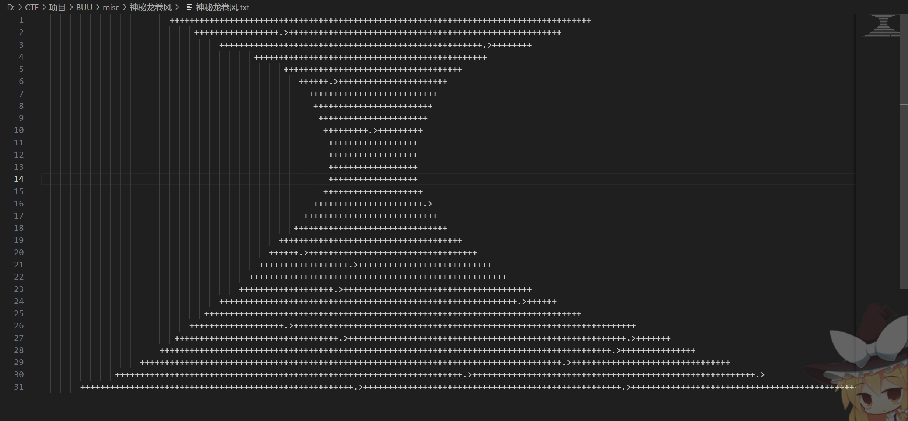

查阅得知，这是`brainfuck`加密，很形象的名字，差点大脑升级，，，

> brainfuck在线解密：[https://www.splitbrain.org/services/ook](https://www.splitbrain.org/services/ook)

`flag{e4bbef8bdf9743f8bf5b727a9f6332a8}`

## FLAG （教练，我...我想打CTF）

`Stegsolve.jar`打开提取数据，得到zip文件

打开提示损坏，但仍然可解压出1文件，得到flag:

`ctf{dd0gf4c3tok3yb0ard4g41n~~~}`

## 假如给我三天光明

下载下来文件，解压得到一个加密的zip和一张图片，图片里有神秘图形，查找得知，这是`盲文`，网上搜对照表解密得出；`kmdonowg`，尝试用这个密码解压压缩包，得到wav音频文件，听出是莫斯电码，解码得到：`CTFWPEI08732?23DZ`，去掉ctf并且全小写即为flag。

## 后门查杀

下载文件会被拦截。。无视风险下载后，找到一个可疑的文件`web.php`，内容是一个典型的webshell:

````php
<?php
  include($_GET[act] . ".php");
?>
````

通过向其传入`act`参数，可以执行任意php文件。但是我们要找的是md5密码，所以继续查找，找到了`attacktest.sql`，里面找到管理员密码：`0192023a7bbd73250516f069df18b500`，遗憾的是这并不是flag，继续查找。

找了半天，在`include/include.php`的第40行找到flag：`6ac45fb83b3bc355c024f5034b947dd3`，后查阅WP才知道，原来有专门的webshell查杀工具。。可以直接得到flag。。。

## webshell后门

这次直接下载了`D盾`，一顿扫描：

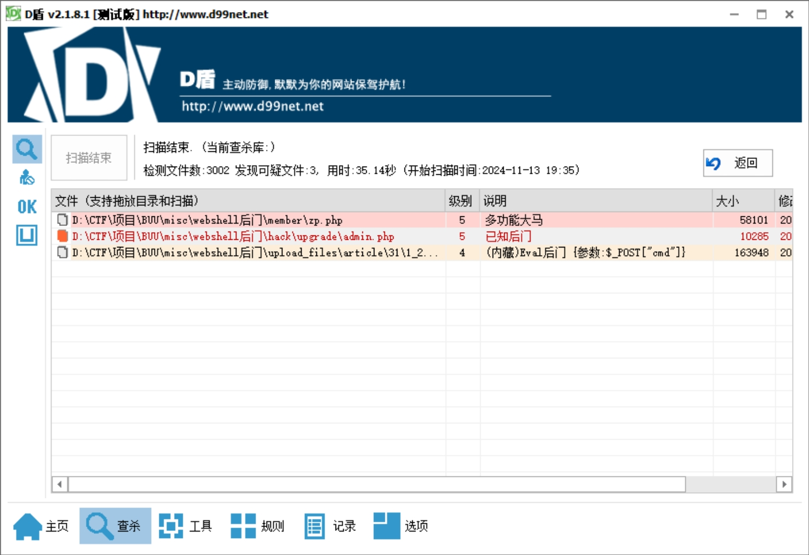

在`/member/zp.php`中31行找到flag：`ba8e6c6f35a53933b871480bb9a9545c`

## 来首歌吧

下载打开，是彩虹猫！

一开始还以为是音频隐写，尝试密码100无法解密，查阅WP发现原来是摩斯电码。。。用`audacity`打开，发现左音频是摩斯电码：

`..... -... -.-. ----. ..--- ..... -.... ....- ----. -.-. -... ----- .---- ---.. ---.. ..-. ..... ..--- . -.... .---- --... -.. --... ----- ----. ..--- ----. .---- ----. .---- -.-.`

解码得到：`5BC925649CB0188F52E617D70929191C`

## 面具下的flag

图片查看16进制，发现后面还有zip，`binwalk`提取出zip，鉴定为zip伪加密，解压得到`flag.vmdk`，用`DiskGenius`打开，得到三个文件夹，拷贝到桌面删不掉了。。。而且也打不开。遂挂载到虚拟机用kali打开：

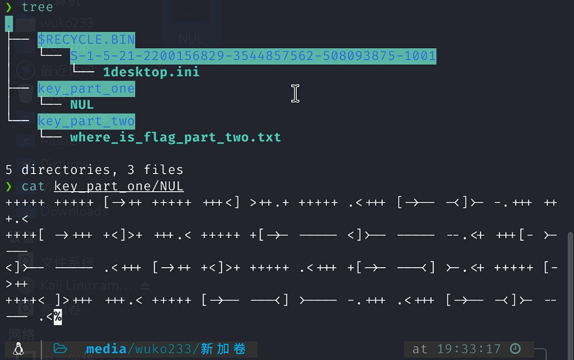

````
+++++ +++++ [->++ +++++ +++<] >++.+ +++++ .<+++ [->-- -<]>- -.+++ +++.<
++++[ ->+++ +<]>+ +++.< +++++ +[->- ----- <]>-- ----- --.<+ +++[- >----
<]>-- ----- .<+++ [->++ +<]>+ +++++ .<+++ +[->- ---<] >-.<+ +++++ [->++
++++< ]>+++ +++.< +++++ [->-- ---<] >---- -.+++ .<+++ [->-- -<]>- ----- .<
````

和[神秘龙卷风](#神秘龙卷风)一样，`brainfuck`加密，解密得到：

`flag{N7F5_AD5`

到这里死活找不到另一半flag，查阅WP才知道，原来只有在Linux上解压才能得到完整文件。。。。。

`7z x flag.vmdk -o./`

得到多了`key_part_two/where_is_flag_part_two.txt:flag_part_two_is_here.txt`

内容是一堆Ook加密，一样的网站解密得到：

`_i5_funny!}`

## 荷兰宽带数据泄露

检查文件，发现这是一个路由器配置文件，给嫩用`RouterPassView`打开（这个软件俺曾在[记:天翼网关ZXHN F650V2.0.0P1T3超管破解](https://blog.wuko.top/posts/2022/03/21/tianyigwpj.html/)用过，妹想到现在居然又能用到），得到明文，试了半天，flag是用户名：`053700357621`

## 九连环

图片`binwalk`提取出zip，伪加密修复得到一张图片和一个压缩包，图片用`steghide`解密：

````bash
 .\steghide.exe extract -sf .\good-已合并.jpg
````

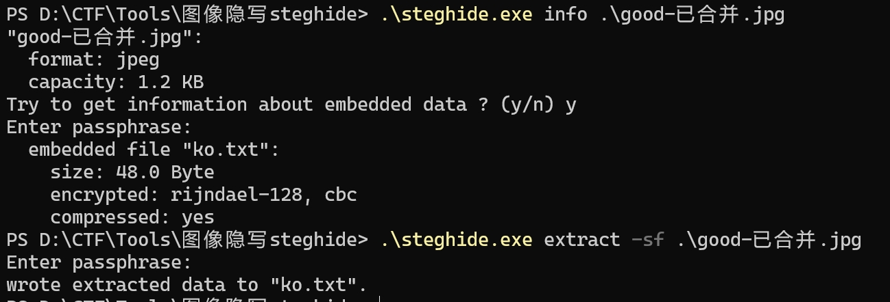

解密得到`ko.txt`:

````
看到这个图片就是压缩包的密码：
bV1g6t5wZDJif^J7
````

用这个解压压缩包，得到flag：`flag{1RTo8w@&4nK@z*XL}`

## [BJDCTF2020]认真你就输了

解压，在`xl/charts/flag.txt`

找到：`flag{M9eVfi2Pcs#}`

## 被劫持的神秘礼物

第四个数据，得到`name:admina,word:adminb`，拼接得到：`adminaadminb`转换为md5 32位全小写：

`1d240aafe21a86afc11f38a45b541a49`

## 被偷走的文件

导出ftp协议传输文件，得到`flag.rar`，加密了，使用`APCHPR`秒了：`5790`

解压得到`flag.txt`:

`flag{6fe99a5d03fb01f833ec3caa80358fa3}`

## [BJDCTF2020]藏藏藏

解压得到图片，用`foremost`提取出zip，解压得到flag：

`flag{you are the best!}`

## [GXYCTF2019]佛系青年

zip伪加密修复，解压得到文本与图片：

````
以上略
佛曰：遮等諳勝能礙皤藐哆娑梵迦侄羅哆迦梵者梵楞蘇涅侄室實真缽朋能。奢怛俱道怯都諳怖梵尼怯一罰心缽謹缽薩苦奢夢怯帝梵遠朋陀諳陀穆諳所呐知涅侄以薩怯想夷奢醯數羅怯諸
````

佛曰密码，[与佛论禅](https://www.keyfc.net/bbs/tools/tudoucode.aspx)解密得到:

`flag{w0_fo_ci_Be1}`

## [BJDCTF2020]你猜我是个啥

直接无法解压，查看文件十六进制，发现是png图片格式，更改后缀，得到一个二维码，扫描得到：`flag²»ÔÚÕâ`实测并不是flag，最后在图片16进制末尾发现flag：

`flag{i_am_fl@g}`

## 刷新过的图片

尝试众多方法，无果，查阅wp，原来是`F5隐写`：

[F5-steganography](https://github.com/matthewgao/F5-steganography)

安装：`git clone https://github.com/matthewgao/F5-steganography`

需要`java8`环境，而且不知道为啥我Windows环境跑啥反应也没有。。。于是在kali装了java8并且解密出了一个`out.txt`:

`java Extract Misc.jpg`

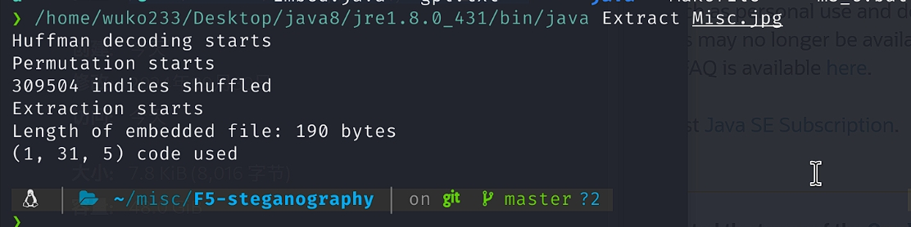

解密得到的文件查看16进制，发现是zip，改后缀发现加密，使用伪加密修复，解压得到flag：

`flag{96efd0a2037d06f34199e921079778ee}`

## 秘密文件

wireshark打开，过滤ftp，发现可疑数据：

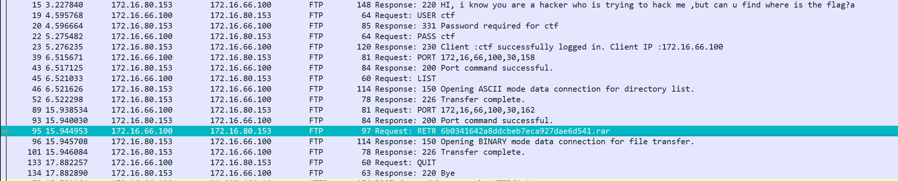

恢复到时间排序，找到文件的传输数据(`tcp.stream eq 6`)，~~ 追踪流导出文件，得到rar压缩包 ~~，这样导出只能得到一部分文件。。。用foremost提取文件，得到加密的rar，使用`APCHPR`秒了：`1903`

解压得到flag：`flag{d72e5a671aa50fa5f400e5d10eedeaa5}`

## [BJDCTF2020]鸡你太美

小鸡子漏出黑脚了，解压得到两个gif，其中副本无法打开。用`010 editor`打开，发现副本缺少GIF头文件`47 49 46 38`，插入，复制自十六进制文本，成功得到flag：

`flag{zhi_yin_you_are_beautiful}`

## [BJDCTF2020]just_a_rar

解压得到加密的rar，名字为四位数，使用`APCHPR`秒了：`2016`

解压得到一jpg，exif中找到flag：`flag{Wadf_123}`

## snake

下载得到一图片，`foremost`分离出一zip，解压得到：

`ciper`: 疑似二进制文件

`key`: 内容为`V2hhdCBpcyBOaWNraSBNaW5haidzIGZhdm9yaXRlIHNvbmcgdGhhdCByZWZlcnMgdG8gc25ha2VzPwo=` base64解码得到：`What is Nicki Minaj's favorite song that refers to snakes?`，谷歌得到：`"Anaconda" is a song by rapper Nicki Minaj.`所以秘钥应是`Anaconda`。

没头绪，查阅wp，原来是`serpent`加密，使用在线解密工具[serpent encryptipn](http://serpent.online-domain-tools.com/)解密得到：

`CTF{who_knew_serpent_cipher_existed}`

## 菜刀666

分析好像是恶意利用eval()注入某些东西，怪不得电脑报毒。。。里面有`z1`和`z2`，目测一个是base64一个是十六进制：

````
z1=RDpcd2FtcDY0XHd3d1x1cGxvYWRcNjY2Ni5qcGc%3D&z2=FFD8FFE000104A4...(后略)
````

z1解码为：`D:\wamp64\www\upload\6666.jpg`

那么z2就应该是这个图片了，用010 editor新建文件，把值复制进去，得到图片：


`Th1s_1s_p4sswd_!!!`


在1367找到一个zip文件以及一串字符：`well,you need passwd!`

foremost提取出zip，发现加密，输入之前找到的密码，得到flag：

`flag{3OpWdJ-JP6FzK-koCMAK-VkfWBq-75Un2z}`

## [BJDCTF2020]一叶障目

修复长宽高，得到：`xaflag{66666}`

## [SWPU2019]神奇的二维码

扫码得到：swpuctf{flag_is_not_here}

`binwalk`提取出4个rar，第一个解压出一张图片和一个加密的压缩包，第二个得到一TXT，内容为base64编码，解码得到：`asdfghjkl1234567890`，试着解压上一个压缩包，发现解压出来的图片和原本的图片是一样的。。。。第三个得到.doc文件，里面是一大堆字符，第四个是加密压缩包。

让AI写了循环解码脚本，得到：`comEON_YOuAreSOSoS0great`

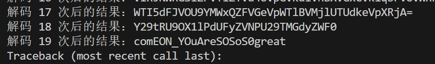

````python
import base64

encoded_string = input("请输入要解码的 base64 字符串：")
count = 0

while encoded_string:
    decoded_string = base64.b64decode(encoded_string).decode('utf-8')
    print(f"解码 {count} 次后的结果：{decoded_string}")
    count += 1
    encoded_string = decoded_string
````

解压压缩包，得到音频文件，判断为摩斯电码，得到：

`morseisveryveryeasy`

## [BJDCTF2020]纳尼

纳尼？GIF是假滴！不慌，看下十六进制先，发现该文件没有gif格式头文件，于是010 editor启动！新建个文件，添加文件头（`47 49 46 38 39 61`）后把源文件拷过去试试，轻松秒杀！得到一张含文本的GIF图片，随后我们拆帧，得到：

.png) .png) .png) .png)

`Q1RGe3dhbmdfYmFvX3FpYW5nX2lzX3NhZH0=`

base64解码得到：`CTF{wang_bao_qiang_is_sad}`

## [HBNIS2018]excel破解

16进制直接查找flag字符：

flag is here `CTF{office_easy_cracked}`

ture dude.

## [HBNIS2018]来题中等的吧

读图得到摩斯电码：`.-/.-../.--./..../.-/.-../.-/-...`

破译得到：`ALPHALAB`

。。。查了半天图片，发现这个全小写就是flag。。。说好的中等的呢。。。

## 梅花香之苦寒来

exif：

````
Image Artist：出题人已跑路~
Image ImageDescription：图穷flag见
````

十六进制查看，发现末尾有许多数字和字母，初步判断为十六进制字符，010editor提取出来，发现是一堆坐标。。。查阅wp，原来是要靠这些坐标生成矢量图。。。

于是在kali安装`gnuplot`:

````bash
apt-get install gnuplot
````

copy过来的脚本稍加修改，把格式转换一下：(x,y) -> x y

````python
with open('xy.txt', 'r') as a:
    a = a.read()
a = a.split()
tem = ''

with open('changed.txt', 'w') as f:
    for i in range(0, len(a)):
        tem = a[i]
        tem = tem.lstrip('(')
        tem = tem.rstrip(')')
        for j in range(0, len(tem)):
            if tem[j] == ',':
                tem = tem[:j] + ' ' + tem[j + 1:]
        f.write(tem + '\n')
````

gnuplot生成：

````
gnuplot> plot "changed.txt"
````

得到：

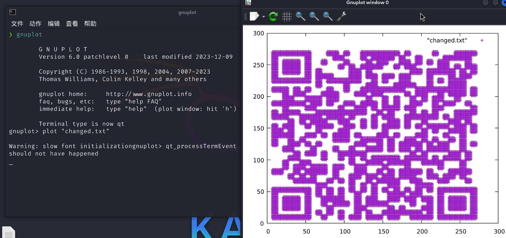

扫码得到：`flag{40fc0a979f759c8892f4dc045e28b820}`

## 谁赢了比赛？

foremost提取出rar，里面有个加密的`hehe.gif`，使用`APCHPR`秒了：`1020`

解压打开，发现是一个棋局，只需要看到最后就能得到flag啦！（被打死

看半天，发现第308和309帧不一样，其中309帧写着：`do_you_know_where is_the_flag`

放到`StegSolve.jar`， red plane得到二维码：

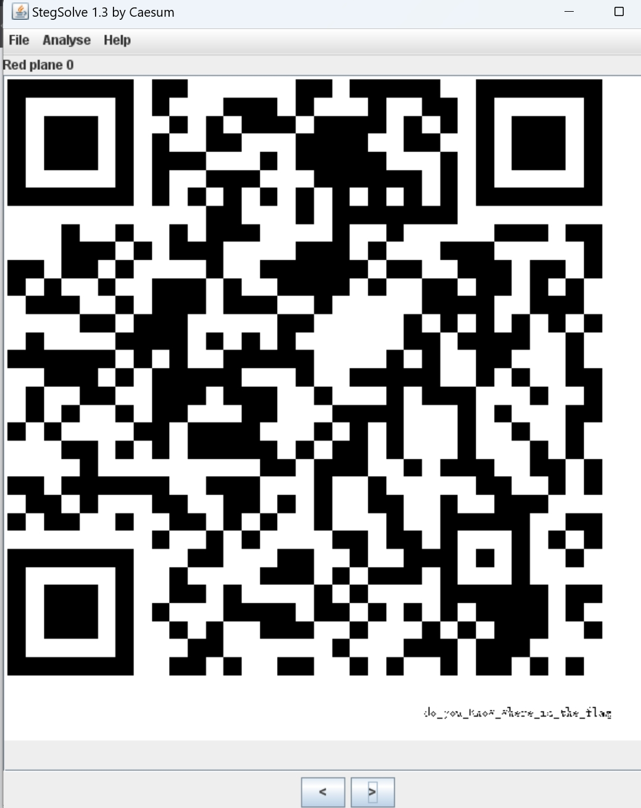

扫码得到：`flag{shanxiajingwu_won_the_game}`

## [ACTF新生赛2020]outguess

图片exif中的备注: `公正民主公正文明公正和谐`

`社会主义核心价值观`解密：`abc`

`outguess`加密

安装outguess:

````bash
git clone https://github.com/crorvick/outguess

./configure && make && make install 
````

解密：

````bash
outguess -k 'abc' -r mmm.jpg out.txt

cat out.txt 
````

得到：

`ACTF{gue33_Gu3Ss!2020}`

## [WUSTCTF2020]find_me

备注里找到了：`⡇⡓⡄⡖⠂⠀⠂⠀⡋⡉⠔⠀⠔⡅⡯⡖⠔⠁⠔⡞⠔⡔⠔⡯⡽⠔⡕⠔⡕⠔⡕⠔⡕⠔⡕⡍=`

似曾相识，盲文，[假如给我三天光明](#假如给我三天光明)

在线解密网站：[文本加密为盲文,可自设密码|文本在线加密解密工具](https://www.qqxiuzi.cn/bianma/wenbenjiami.php?s=mangwen)

解密得到：`wctf2020{y$0$u_f$1$n$d$_M$e$e$e$e$e}`

## 穿越时空的思念

`audacity`打开，发现是摩斯电码:

`..-. ----- ..--- ----. -... -.. -.... ..-. ..... ..... .---- .---- ...-- ----. . . -.. . -... ---.. . ....- ..... .- .---- --... ..... -... ----- --... ---.. -....`

解码得到：

`F029BD6F551139EEDEB8E45A175B0786`

即为`flag{f029bd6f551139eedeb8e45a175b0786}`

## [SWPU2019]我有一只马里奥

双击打开，得到文本：

````
ntfs      
flag.txt
````

查阅wp得知，命令行打开：

`notepad 1.txt:flag.txt`

得到`swupctf{ddg_is_cute}`

## [GUET-CTF2019]KO

[https://www.splitbrain.org/services/ook](https://www.splitbrain.org/services/ook)

解密得到：`welcome to CTF`

## [ACTF新生赛2020]base64隐写

参考wp脚本，多次解密base64:

````python
import base64
b64chars = 'ABCDEFGHIJKLMNOPQRSTUVWXYZabcdefghijklmnopqrstuvwxyz0123456789+/'
with open('./base64.txt', 'rb') as f:
    flag = ''
    bin_str = ''
    for line in f.readlines():
        stegb64 = str(line, "utf-8").strip("\n")
        rowb64 = str(base64.b64encode(base64.b64decode(stegb64)), "utf-8").strip("\n")
        offset = abs(b64chars.index(stegb64.replace('=', '')[-1]) - b64chars.index(rowb64.replace('=', '')[-1]))
        equalnum = stegb64.count('=')  # no equalnum no offset
        if equalnum:
            bin_str += bin(offset)[2:].zfill(equalnum * 2)
            # flag += chr(int(bin(offset)[2:].zfill(equalnum * 2), 2))
            # print(flag) 这样写得不出正确结果
        print([chr(int(bin_str[i:i + 8], 2)) for i in range(0, len(bin_str), 8)])


# ['A', 'C', 'T', 'F', '{', '6', 'a', 's', 'e', 'b', '4', '_', 'f', '3', '3', '!', '}'
````

`flag{6aseb4_f33!}`

## [第五空间 2021]alpha10

`foremost`提取文件，得到一张jpg一张png，推测双图盲水印：

随波逐流没反应。。。用下面这个仓库：

(BlindWaterMark)[https://github.com/chishaxie/BlindWaterMark]

安装依赖后执行：

````cmd
PS D:\CTF\Tools\BlindWaterMark> python bwmforpy3.py decode .\alpha0\00001537.png .\alpha0\00001404.jpg .\alpha0\outwm.png
image<.\alpha0\00001537.png> + image(encoded)<.\alpha0\00001404.jpg> -> watermark<.\alpha0\outwm.png>
````

得到：


`flag{XqAe3QzK2ehD5fWv8jfBitPqHUw0}`
