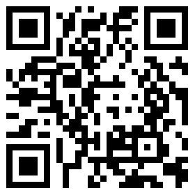

## 签到

`flag{buu_ctf}`

## 金三胖

给定GIF文件，可以很明显看到flag文字，对文件进行拆解，在`20`、`50`与`78`帧找到flag：

  

## 你竟然赶我走

查看文件元数据，末尾得到flag：


`flag{stego_is_s0_bor1ing}`

## 二维码


直接扫码得到flag...并没有，扫码得到：`secret is here`

十六进制分析，发现有zip文件，使用`binwalk`分离，发现有一个名为`4number.txt`加密文件，使用`APCHPR`秒了：

````
Advanced Archive Password Recovery 统计信息:
加密的 ZIP/RAR/ACE/ARJ 文件: D:\BUU\misc\二维码\_QR_code.png.extracted\1D7.zip
总计口令: 8,741
总计时间: 10ms 
平均速度(口令/秒): 874,100
这个文件的口令 : 7639
十六进制口令: 37 36 33 39 
````

得到`CTF{vjpw_wnoei}`

## 大白

修复图片长宽高，得到:`flag{He1l0_d4_ba1}`


## 乌镇峰会种图

同[你居然赶我走](#你竟然赶我走)，查看文件元数据末尾得到flag：

`flag{97314e7864a8f62627b26f3f998c37f1}`

## wireshark

用`wireshark`打开，查找关键词找到password：


`flag{ffb7567a1d4f4abdffdb54e022f8facd}`

## N种方法解决

下载下来发现是`.exe`文件，直接运行失败，拖到`IDA pro`里查看，发现其开头为`data:image/jpg;base64`后跟一串base64，将它转换为图片：


扫码得到：`KEY{dca57f966e4e4e31fd5b15417da63269}`

## 基础破解

> 给你一个压缩包，你并不能获得什么，因为他是四位数字加密的哈哈哈哈哈哈哈。。。不对= =我说了什么了不得的东西。。

使用`APCHPR`秒了：`2563`

解压得到flag.txt，内容`ZmxhZ3s3MDM1NDMwMGE1MTAwYmE3ODA2ODgwNTY2MWI5M2E1Y30=`

base64解码: `flag{70354300a5100ba78068805661b93a5c}`

## 文件中的秘密

下载，直接查看图片属性，得到flag：`flag{870c5a72806115cb5439345d8b014396}`


## zip伪加密

谜底出在谜面上，对它使用zip伪加密修复吧！

得到flag.txt:`flag{Adm1N-B2G-kU-SZIP}`

## LSB

使用`Stegsolve.jar`提取RGB通道数据，得到二维码：



扫描得到：`cumtctf{1sb_i4_s0_Ea4y}`

## 被嗅探的流量

`wireshark`打开，http分类，找到upload:


`flag{da73d88936010da1eeeb36e945ec4b97}`

## rar

已知密码是4位，使用`APCHPR`秒了：`8795`

解压得到：`flag{1773c5da790bd3caff38e3decd180eb7}`

## qr

扫码得到：`欢迎参加本次比赛，密码为 Flag{878865ce73370a4ce607d21ca01b5e59}`

## 镜子里面的世界

`Stegsolve.jar`打开提取数据：


`Hey I think we can write safely in this file without any one seeing it. Anyway, the secret key is: st3g0_ saurus_wr3cks`

`flag{st3g0_saurus_wr3cks}`

## 爱因斯坦

查看图片16进制，好家伙，塞了一个zip，使用`binwalk`分离，得到一个加密的zip，`APCHPR`失败，继续寻找密码。。。图片exif找到：`this_is_not_password`，尝试，得到flag：`flag{dd22a92bf2cceb6c0cd0d6b83ff51606}`

## ningen

下载图片查看十六进制，发现还有其他文件，使用`foremost`提取出加密的zip，结合提示`秋明特别讨厌中国的六位银行密码，喜欢四位数`,`APCHPR`秒了:`8368`

`flag{b025fc9ca797a67d2103bfbc407a6d5f}`

## 小明的保险箱

和[ningen](#ningen)一样，`binwalk`分离得到rar文件，根据提示4位数，`APCHPR`秒了：`7869`

`flag{75a3d68bf071ee188c418ea6cf0bb043}`

## easycap

`wireshark`发现全是`TCP`，右键`追踪流`得到：

`FLAG:385b87afc8671dee07550290d16a8071`

## 隐藏的钥匙

查看图片元数据，找到文本：`flag:base64:(Mzc3Y2JhZGRhMWVjYTJmMmY3M2QzNjI3Nzc4MWYwMGE=).`

base64解码得到：`377cbadda1eca2f2f73d36277781f00a`

## 另外一个世界

图片查看元数据，结尾发现

`01101011011011110110010101101011011010100011001101110011`

判断为2进制，转换成文字为：`koekj3s`

## 数据包中的线索

`wireshark`追踪http流，得到一大串base64码，转换成图片：


`flag{209acebf6324a09671abc31c869de72c}`

## 神秘龙卷风

根据提示4位数，`APCHPR`秒了：`5463`

解压打开一看，不是哥们：


查阅得知，这是`brainfuck`加密，很形象的名字，差点大脑升级，，，

> brainfuck在线解密：[https://www.splitbrain.org/services/ook](https://www.splitbrain.org/services/ook)

`flag{e4bbef8bdf9743f8bf5b727a9f6332a8}`

## FLAG （教练，我...我想打CTF）

`Stegsolve.jar`打开提取数据，得到zip文件

打开提示损坏，但仍然可解压出1文件，得到flag:

`ctf{dd0gf4c3tok3yb0ard4g41n~~~}`

## 假如给我三天光明

下载下来文件，解压得到一个加密的zip和一张图片，图片里有神秘图形，查找得知，这是`盲文`，网上搜对照表解密得出；`kmdonowg`，尝试用这个密码解压压缩包，得到wav音频文件，听出是莫斯电码，解码得到：`CTFWPEI08732?23DZ`，去掉ctf并且全小写即为flag。

## 后门查杀

下载文件会被拦截。。无视风险下载后，找到一个可疑的文件`web.php`，内容是一个典型的webshell:

````php
<?php
  include($_GET[act] . ".php");
?>
````

通过向其传入`act`参数，可以执行任意php文件。但是我们要找的是md5密码，所以继续查找，找到了`attacktest.sql`，里面找到管理员密码：`0192023a7bbd73250516f069df18b500`，遗憾的是这并不是flag，继续查找。

找了半天，在`include/include.php`的第40行找到flag：`6ac45fb83b3bc355c024f5034b947dd3`，后查阅WP才知道，原来有专门的webshell查杀工具。。可以直接得到flag。。。

## webshell后门

这次直接下载了`D盾`，一顿扫描：


在`/member/zp.php`中31行找到flag：`ba8e6c6f35a53933b871480bb9a9545c`

## 来首歌吧

下载打开，是彩虹猫！

