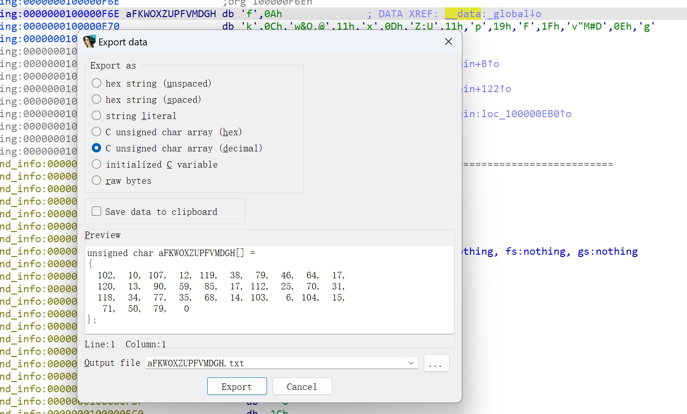

## easyre

IDA pro查看伪代码快捷键`F5`

````c
int __fastcall main(int argc, const char **argv, const char **envp)
{
  int b; // [rsp+28h] [rbp-8h] BYREF
  int a; // [rsp+2Ch] [rbp-4h] BYREF

  _main();
  scanf("%d%d", &a, &b);
  if ( a == b )
    printf("flag{this_Is_a_EaSyRe}");
  else
    printf("sorry,you can't get flag");
  return 0;
}
````

EZ，`flag{this_Is_a_EaSyRe}`

## reverse1

IDA Pro查看字符串类型快捷键：`Shift + F12`

直接找到了`.data:000000014001C000	0000000E	C	{hello_world}`

但提交并不对，继续查找，找到：

````
.rdata:0000000140019C90	00000019	C	this is the right flag!\n
````

双击进入，查看是哪段函数调用了该字符串`Ctrl + X`:

````c
  sub_1400111D1("input the flag:");
  sub_14001128F("%20s", Str1);
  v5 = j_strlen(Str2);
  if ( !strncmp(Str1, Str2, v5) )
    sub_1400111D1("this is the right flag!\n");
  else
    sub_1400111D1("wrong flag\n");
  return 0;
````

`strcmp`判断str1与str2是否相等，str1是输入的字符串，所以str2应该就是flag的值，点击str2高亮它，发现它上面经过了一个处理：

````c
for ( j = 0; ; ++j )
  {
    v10 = j;
    if ( j > j_strlen(Str2) )
      break;
    if ( Str2[j] == 111 )
      Str2[j] = 48;
  }
````

可以看到，经过一个遍历，str2中的111被改变为48，这是ascii码，选中数字后按下`R`转化为字符：

````c
    if ( Str2[j] == 'o' )
      Str2[j] = '0';
````

双击str2，可以看到str2是`{hello_world}`，那么flag即为：`{hell0_w0rld}`

## reverse2

一样的步骤，F5分析main:

````c
for ( i = 0; i <= strlen(&flag); ++i )
{
  if ( *(&flag + i) == 105 || *(&flag + i) == 114 )
    *(&flag + i) = 49;
}
````

R转换为字符：

````c
for ( i = 0; i <= strlen(&flag); ++i )
{
  if ( *(&flag + i) == 'i' || *(&flag + i) == 'r' )
    *(&flag + i) = '1';
}
````

遍历，如果字符是`i`或者`r`，转换为`1`。

双击flag:

````c
.data:0000000000601080 flag            db 7Bh                  ; DATA XREF: main+34↑r
.data:0000000000601080                                         ; main+44↑r ...
.data:0000000000601081 aHackingForFun  db 'hacking_for_fun}',0
````

其中`7Bh`R一下就是`{`

所以flag处理前是`{hacking_for_fun}`，处理后就是：`{hack1ng_fo1_fun}`

## 内涵的软件

`shift + F12`秒了...

`DBAPP{49d3c93df25caad81232130f3d2ebfad}`

但还是分析下：

````c
int __cdecl main_0(int argc, const char **argv, const char **envp)
{
  char v4[4]; // [esp+4Ch] [ebp-Ch] BYREF
  const char *v5; // [esp+50h] [ebp-8h]
  int v6; // [esp+54h] [ebp-4h]

  v6 = 5;
  v5 = "DBAPP{49d3c93df25caad81232130f3d2ebfad}";
  while ( v6 >= 0 )
  {
    printf(aD, v6);
    sub_40100A();
    --v6;
  }
  printf(
    "\n"
    "\n"
    "\n"
    "这里本来应该是答案的,但是粗心的程序员忘记把变量写进来了,你要不逆向试试看:(Y/N)\n");
  v4[0] = 1;
  scanf("%c", v4);
  if ( v4[0] == 89 )
  {
    printf(aOdIda);
    return sub_40100A();
  }
  else
  {
    if ( v4[0] == 78 )
      printf(asc_425034);
    else
      printf("输入错误,没有提示.");
    return sub_40100A();
  }
}
````

定义了字符串v5但是没有使用，所以是`忘记把变量写进来了`

## 新年快乐

`DIE`查壳：UPX(3.91)[NRV,best]

脱壳，虽然打不开程序了，但是ida可以分析了：

````c
strcpy(Str2, "HappyNewYear!");
*(_WORD *)Str1 = word_40306B;
memset(&Str1[2], 0, 0x1Eu);
printf("please input the true flag:");
scanf("%s", Str1);
if ( !strncmp(Str1, Str2, strlen(Str2)) )
  return puts(aThisIsTrueFlag);
else
  return puts(Buffer);
````

得到了`HappyNewYear!`

## xor

````c
memset(__b, 0, 0x100uLL);
printf("Input your flag:\n");
get_line(__b, 256LL);
if ( strlen(__b) != 33 )
  goto LABEL_7;
for ( i = 1; i < 33; ++i )
  __b[i] ^= __b[i - 1];  //异或操作
if ( !strncmp(__b, global, 0x21uLL) )
  printf("Success");
else
LABEL_7:
  printf("Failed");
return 0;
````

输入`__b`，异或后与`global`进行比较，所以`global`应该是flag异或后的值。

提取`global`，`shift + E`导出数据：



python写一遍异或的部分:

````python
lst = [102, 10, 107, 12, 119, 38, 79, 46, 64, 17, 120, 13, 90, 59, 85, 17, 112, 25, 70, 31, 118, 34, 77, 35, 68, 14, 103, 6, 104, 15, 71, 50, 79, 0]
flag = chr(lst[0])

for i in range(1, len(lst)):
    flag += chr(lst[i] ^ lst[i - 1])
print(flag)

# flag{QianQiuWanDai_YiTongJiangHu}O
````

得到：`flag{QianQiuWanDai_YiTongJiangHu}`

## reverse3

````c
nt __cdecl main_0(int argc, const char **argv, const char **envp)
{
  size_t v3; // eax
  const char *v4; // eax
  size_t v5; // eax
  char v7; // [esp+0h] [ebp-188h]
  char v8; // [esp+0h] [ebp-188h]
  signed int j; // [esp+DCh] [ebp-ACh]
  int i; // [esp+E8h] [ebp-A0h]
  signed int v11; // [esp+E8h] [ebp-A0h]
  char Destination[108]; // [esp+F4h] [ebp-94h] BYREF
  char Str[28]; // [esp+160h] [ebp-28h] BYREF
  char v14[8]; // [esp+17Ch] [ebp-Ch] BYREF

  for ( i = 0; i < 100; ++i )
  {
    if ( (unsigned int)i >= 0x64 )
      j____report_rangecheckfailure();
    Destination[i] = 0;
  }
  sub_41132F("please enter the flag:", v7);
  sub_411375("%20s", (char)Str);
  v3 = j_strlen(Str);
  v4 = (const char *)sub_4110BE(Str, v3, v14);
  strncpy(Destination, v4, 0x28u);
  v11 = j_strlen(Destination);
  for ( j = 0; j < v11; ++j )
    Destination[j] += j;
  v5 = j_strlen(Destination);
  if ( !strncmp(Destination, Str2, v5) )
    sub_41132F("rigth flag!\n", v8);
  else
    sub_41132F("wrong flag!\n", v8);
  return 0;
}
````

先查看`Str2`变量，得到值`e3nifIH9b_C@n@dH`，然后一步一步往上推。

````c
  for ( j = 0; j < v11; ++j )
    Destination[j] += j;
````

`Destination`为输入的flag后经过处理的字符串，在这个循环中又经过了位移处理：

每个字符向右偏移它位置的值。

举个例子就好理解了：

假设`Destination`为`{'A', 'B'}`，那么`A = A + 0`(A位于0)，`B = B + 1 = C`(B位于1，B+1为C，ASCII码)。

AI写个逆向脚本：

````python
original_str = "e3nifIH9b_C@n@dH"
result_str = ""
index = 0

for char in original_str:
    # 获取ASCII码 → 减索引 → 转回字符
    decoded_char = chr(ord(char) - index)
    result_str += decoded_char
    index += 1

print(result_str) #e2lfbDB2ZV95b3V9
````

`e2lfbDB2ZV95b3V9`

然后继续溯源，`sub_4110BE()`返回`sub_411AB0()`函数处理后的内容，先查看它传入411了什么参数：

````c
char v14[8];
v4 = (const char *)sub_4110BE(Str, v3, (int *)v14);
````

````c
void *__cdecl sub_411AB0(char *a1, unsigned int a2, int *a3)
{
  int v4; // [esp+D4h] [ebp-38h]
  int v5; // [esp+D4h] [ebp-38h]
  int v6; // [esp+D4h] [ebp-38h]
  int v7; // [esp+D4h] [ebp-38h]
  int i; // [esp+E0h] [ebp-2Ch]
  unsigned int v9; // [esp+ECh] [ebp-20h]
  int v10; // [esp+ECh] [ebp-20h]
  int v11; // [esp+ECh] [ebp-20h]
  void *v12; // [esp+F8h] [ebp-14h]
  char *v13; // [esp+104h] [ebp-8h]

  if ( !a1 || !a2 )
    return 0;
  v9 = a2 / 3;
  if ( (int)(a2 / 3) % 3 )
    ++v9;
  v10 = 4 * v9;
  *a3 = v10;
  v12 = malloc(v10 + 1);
  if ( !v12 )
    return 0;
  j_memset(v12, 0, v10 + 1);
  v13 = a1;
  v11 = a2;
  v4 = 0;
  while ( v11 > 0 )
  {
    byte_41A144[2] = 0;
    byte_41A144[1] = 0;
    byte_41A144[0] = 0;
    for ( i = 0; i < 3 && v11 >= 1; ++i )
    {
      byte_41A144[i] = *v13;
      --v11;
      ++v13;
    }
    if ( !i )
      break;
    switch ( i )
    {
      case 1:
        *((_BYTE *)v12 + v4) = aAbcdefghijklmn[(int)(unsigned __int8)byte_41A144[0] >> 2];
        v5 = v4 + 1;
        *((_BYTE *)v12 + v5) = aAbcdefghijklmn[((byte_41A144[1] & 0xF0) >> 4) | (16 * (byte_41A144[0] & 3))];
        *((_BYTE *)v12 + ++v5) = aAbcdefghijklmn[64];
        *((_BYTE *)v12 + ++v5) = aAbcdefghijklmn[64];
        v4 = v5 + 1;
        break;
      case 2:
        *((_BYTE *)v12 + v4) = aAbcdefghijklmn[(int)(unsigned __int8)byte_41A144[0] >> 2];
        v6 = v4 + 1;
        *((_BYTE *)v12 + v6) = aAbcdefghijklmn[((byte_41A144[1] & 0xF0) >> 4) | (16 * (byte_41A144[0] & 3))];
        *((_BYTE *)v12 + ++v6) = aAbcdefghijklmn[((byte_41A144[2] & 0xC0) >> 6) | (4 * (byte_41A144[1] & 0xF))];
        *((_BYTE *)v12 + ++v6) = aAbcdefghijklmn[64];
        v4 = v6 + 1;
        break;
      case 3:
        *((_BYTE *)v12 + v4) = aAbcdefghijklmn[(int)(unsigned __int8)byte_41A144[0] >> 2];
        v7 = v4 + 1;
        *((_BYTE *)v12 + v7) = aAbcdefghijklmn[((byte_41A144[1] & 0xF0) >> 4) | (16 * (byte_41A144[0] & 3))];
        *((_BYTE *)v12 + ++v7) = aAbcdefghijklmn[((byte_41A144[2] & 0xC0) >> 6) | (4 * (byte_41A144[1] & 0xF))];
        *((_BYTE *)v12 + ++v7) = aAbcdefghijklmn[byte_41A144[2] & 0x3F];
        v4 = v7 + 1;
        break;
    }
  }
  *((_BYTE *)v12 + v4) = 0;
  return v12;
}
````

AI分析，这是一个`Base64编码函数`:

````c
char* base64_encode(const void* input, size_t len, int* out_len);
````

解码得到：`{i_l0ve_you}`