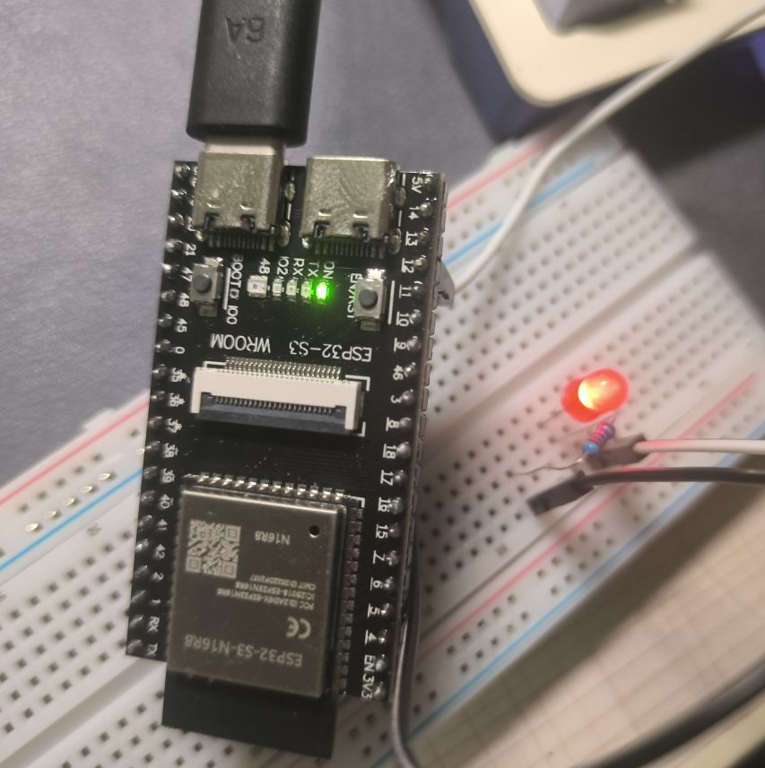

<iframe frameborder="no" border="0" marginwidth="0" marginheight="0" width=330 height=86 src="//music.163.com/outchain/player?type=2&id=34923690&auto=0&height=66"></iframe>

电耗室。

## 前言

**本文偏向于小白记录生活，大佬轻喷**

为了得到大创课那点学分，决定做个软硬件结合的物联网项目。软件方面比较好说，但是硬件方面本人是从来没有接触过的，先前最多就是刷刷固件，修修小家电之类的。故决定踏入这个未知的领域，技多不压身嘛~

### 购入

PDD花了44.3购入了一块`ESP32-S3 N16R8`开发板和一个`OV2640`摄像头（因为大创项目大概要涉及到WiFi通讯和视频传输，所以先买来练练手），苦等一个星期终于到货，迫不及待就开始操作。

### 参数

| 类别         | 参数                                                                 |
|------------------|----------------------------------------------------------------------|
| **主控芯片**     | ESP32-S3 (双核 LX7 32 位处理器，主频 240 MHz)                        |
| **开发板品牌**         | freenova  |
| **存储配置**     | - Flash: 16 MB<br>- PSRAM: 8 MB                                      |
| **开发环境**     | VSCode/PlatformIO                     |

## 准备工作

VSCode里安装`PlatformIO`拓展，配置信息：

```ini
platform = espressif32
board = esp32-s3-devkitc-1
framework = arduino
```

等待漫长的环境配置...

因为`esp32-s3-devkitc-1`默认存储信息和这个开发板不符，所以修改`platformio.ini`，加入以下内容:

````ini
; 指定为16MB的FLASH分区表
board_build.arduino.partitions = default_16MB.csv
; 指定FLASH和PSRAM的运行模式
board_build.arduino.memory_type = qio_opi
; 预定义宏，启用PSRAM
build_flags = -DBOARD_HAS_PSRAM
; 指定FLASH容量为16MB
board_upload.flash_size = 16MB
````

> 来自：[CSDN](https://blog.csdn.net/CD391/article/details/139878023)


### 驱动

`CH343`:[http://www.wch-ic.com/search?t=all&q=ch343](http://www.wch-ic.com/search?t=all&q=ch343)

完成预安装后连接板子就完成了驱动的安装。

## 点灯&串口通讯输出与监听

````cpp
#include <Arduino.h>

#define LED_BUILTIN 2
// 定义LED GPIO引脚为2

// put function declarations here:
int myFunction(int, int);

void setup() {
  // put your setup code here, to run once:
  int result = myFunction(2, 3);
  pinMode(LED_BUILTIN, OUTPUT);
  // 设置LED为输出模式
  Serial.begin(115200);
  // 初始化串口通信为115200
  delay(1000);
  Serial.printf("Chip Model: %s\n", ESP.getChipModel());
  Serial.printf("Flash Size: %d MB\n", ESP.getFlashChipSize() / (1024 * 1024));
  Serial.printf("PSRAM Size: %d MB\n", ESP.getPsramSize() / (1024 * 1024));
  // 输出芯片信息
}

void loop() {
  // put your main code here, to run repeatedly:
  digitalWrite(LED_BUILTIN, HIGH);
  delay(1000);
  digitalWrite(LED_BUILTIN, LOW);
  delay(1000);
  // 高电平亮，低电平熄，间隔一秒
}

// put function definitions here:
int myFunction(int x, int y) {
  return x + y;
}
````

串口通讯需在`platformio.ini`中添加：

````ini
monitor_speed = 115200
````

左下角`upload`（→）后，再点击`serial monitor`（插头），即可看到输出：

````
ESP-ROM:esp32s3-20210327
Build:Mar 27 2021
rst:0x1 (POWERON),boot:0x8 (SPI_FAST_FLASH_BOOT)
SPIWP:0xee
mode:DIO, clock div:1
load:0x3fce3808,len:0x4bc
load:0x403c9700,len:0xbd8
load:0x403cc700,len:0x2a0c
entry 0x403c98d0
Chip Model: ESP32-S3
Flash Size: 16 MB
PSRAM Size: 7 MB
````

### 一些困惑

开发板手册直接写了LED—IO2的GPIO是2，但是看开发板定义图里GPIO2定义的是ON那个LED，上传代码后亮的却是IO2的LED（这个LED在定义图里没有定义），不太明白。。

还有`PSRAM`理论上来说应该是8MB，不知道为啥输出是7MB。。

### 点亮外部引脚LED

其实是一个原理，设置某个引脚是高电平，然后和LED串联起来，最后接到GND就行。

````cpp
...
// 定义外接LED针脚为GPIO12
#define LED_OUTBRD 12

void setup() {
    // 设置GPIO12为输出模式
    pinMode(LED_OUTBRD, OUTPUT);
    // 设置高电平点亮LED
    digitalWrite(LED_OUTBRD, HIGH);
    ...
}

...
````

接了1k的电阻防止烧坏LED。



还写了个简单的程序接入了deepseek的api，等后面再说吧，懒= =。
