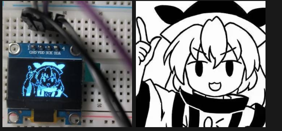

## 前言

七毛九淘宝买了块0.96寸的1315驱动的OLED显示屏，到货焊接四根针脚：`GND、VDD、SCK、SDA`，由此得知这块屏幕走的是i2c协议。

全网找了半天都没有在VSCode platformIO 里导入U8g2库的教程（也可能是我搜索的姿势不对），摸索了半天才点亮，所以写一篇教程方便和我一样不清楚的小白查阅。

## 接线

`GND` - `GND`

`VCC` - `3.3V/5V`

`SCK(SCL)` - `自定义口1`

`SDA(MOSI)` - `自定义口2`

## U8g2库的安装

在`VSCode`>`PlatformIO`>`PIO Home`>`Libraries`中搜索`U8g2`:


点击，添加至项目，等待漫长的安装...(因为U8g2是一个兼容多平台的图像库，所以内容很多)

安装好之后可以在你项目文件夹里的

`\.pio\libdeps\esp32dev\U8g2`

找到依赖和示例，至此和Arduino IDE里使用方法一致。

注意，如果你先前还安装过Library里其他的屏幕驱动，需要把它删干净了再编译上传，不然可能会冲突报错= =。

## 点亮

以我手中这块128x64单色OLED屏幕为例：

````cpp
#include <Arduino.h>
#include <U8g2lib.h>

// 自定义的CLK和SDA引脚
#define OLED_CLK  12  
#define OLED_SDA  9
// 构造对象
U8G2_SSD1306_128X64_NONAME_F_SW_I2C OLED(U8G2_R0, OLED_CLK, OLED_SDA, U8X8_PIN_NONE);  // 选择你屏幕的规格，1315也可以用1306的驱动

void setup() {
  // 初始化OLED
  OLED.begin();
  // 开启中文字符集支持
  OLED.enableUTF8Print();
  // 设置字体
  OLED.setFont(u8g2_font_wqy12_t_gb2312);
}

void loop() {
 
  // 清除缓存区内容
  OLED.clearBuffer();
  // 绘制内容
  OLED.setCursor(0, 10);
  OLED.print("Hello, world!");

  OLED.setCursor(0, 30);
  OLED.print("你好,世界!");

  // 发送缓存区内容到OLED
  OLED.sendBuffer();

  delay(1000);
}
````

带点私货，点亮：


> Ciallo～(∠・ω< )⌒☆

## 图片

使用[image2cpp](https://javl.github.io/image2cpp/)或`pctolcd2002`将图像转换为位图数组。

示例代码：

````cpp
#include <Arduino.h>
#include <U8g2lib.h>

// 硬件I2C配置
#define OLED_SDA 20
#define OLED_SCL 21
U8G2_SSD1306_128X64_NONAME_F_HW_I2C OLED(U8G2_R0, U8X8_PIN_NONE, OLED_SCL, OLED_SDA);

// 128x64 XBM格式图像数据（示例数据，需替换为你的实际数据）
static const unsigned char imageData[] U8X8_PROGMEM = {
  // 这里替换为你的实际128x64图像数据（1024字节）
    0x00,0x00,0x00,0x00,0x00,0x00,0x00,0xC0,0xFF,0xFF,0x01,0x00,0x00,0x00,0x00,0x00,0x00,0x00,0x00,0x00,0x00,0x00,0x00,0xF0,0xFF,0xFF,0x03,0x00,0x00,0x00,0x00,0x00,
    0x00,0x00,0x00,0x00,0x00,0xF8,0x03,0xF8,0xFF,0xFF,0x07,0x00,0x00,0x00,0x00,0x00,0x00,0x00,0x00,0x00,0x00,0xFE,0x1F,0xFC,0xFF,0xFF,0x0F,0xE0,0x07,0x00,0x00,0x00,
    0x00,0x00,0x00,0x00,0x00,0xFE,0x3F,0xFE,0xFF,0xFF,0x1F,0xFE,0x1F,0x00,0x00,0x00,0x00,0x00,0x00,0x00,0x00,0xFC,0x7F,0xFF,0xFF,0xFF,0x3F,0xFF,0x1F,0x00,0x00,0x00,
    0x00,0x00,0x00,0x00,0x00,0xF8,0xFF,0xFF,0x00,0xC0,0xFF,0xFF,0x1F,0x00,0x00,0x00,0x00,0x00,0x00,0x00,0x00,0xF8,0xFF,0x0F,0x00,0x00,0xFC,0xFF,0x0F,0x00,0x00,0x00,
    0x00,0x00,0x00,0x00,0x07,0xF0,0xFF,0x01,0x40,0x01,0xF0,0xFF,0x07,0x00,0x00,0x00,0x00,0x00,0x00,0x00,0x09,0xE0,0x7F,0x00,0x38,0x02,0xC0,0xFF,0x03,0x00,0x00,0x00,
    0x00,0x00,0x00,0x00,0x09,0xC0,0x1F,0x00,0x04,0x44,0x00,0xFF,0x01,0x00,0x00,0x00,0x00,0x00,0x00,0x00,0x11,0x00,0x07,0x60,0x00,0x34,0x03,0xFC,0x00,0x00,0x00,0x00,
    0x00,0x00,0x00,0x00,0x10,0x00,0x01,0x08,0x03,0x08,0x04,0x38,0x00,0x00,0x00,0x00,0x00,0x00,0x00,0x00,0x12,0x80,0x00,0x02,0x00,0x08,0x10,0x10,0x00,0x00,0x00,0x00,
    0x00,0x00,0x00,0x00,0x02,0x40,0x80,0x01,0x01,0x00,0x20,0x60,0x00,0x00,0x00,0x00,0x00,0x00,0x00,0x00,0x02,0x20,0x40,0x00,0x01,0x10,0x40,0xC0,0x00,0x00,0x00,0x00,
    0x00,0x00,0x00,0x00,0x00,0x10,0x20,0x00,0x00,0x10,0x80,0x80,0x00,0x00,0x00,0x00,0x00,0x00,0x00,0x00,0x24,0x3C,0x10,0x00,0x00,0x10,0x00,0x01,0x01,0x00,0x00,0x00,
    0x00,0x00,0x00,0x00,0x24,0x53,0x08,0x00,0x00,0x10,0x00,0x02,0x02,0x00,0x00,0x00,0x00,0x00,0x00,0x00,0xA4,0x88,0x04,0x00,0x00,0x10,0x00,0x00,0x01,0x00,0x00,0x00,
    0x00,0x00,0x00,0x00,0xFB,0x00,0x13,0x08,0x00,0x30,0x04,0xC4,0x00,0x00,0x00,0x00,0x00,0x00,0x00,0x80,0x60,0x04,0x02,0x80,0x01,0x30,0x08,0x20,0x00,0x00,0x00,0x00,
    0x00,0x00,0x00,0x00,0x80,0x00,0x09,0x84,0x01,0x50,0x08,0x18,0x00,0x00,0x00,0x00,0x00,0x00,0x00,0x40,0x88,0x82,0x04,0x94,0x11,0x90,0x09,0x08,0x00,0x00,0x00,0x00,
    0x00,0x00,0x00,0x40,0x50,0x80,0x02,0xC4,0x11,0xD0,0x08,0x00,0x00,0x00,0x00,0x00,0x00,0x00,0x00,0x20,0x64,0x41,0x03,0x48,0x13,0x10,0x09,0x00,0x00,0x00,0x00,0x00,
    0x00,0x00,0x00,0x20,0x28,0x41,0x03,0x4C,0x36,0x0C,0x09,0x10,0x00,0x00,0x00,0x00,0x00,0x00,0x00,0x20,0x10,0x81,0x01,0x54,0x24,0x08,0x0A,0x10,0x00,0x00,0x00,0x00,
    0x00,0x00,0x00,0x20,0x90,0x20,0x01,0x62,0x58,0x00,0x16,0x10,0x00,0x00,0x00,0x00,0x00,0x00,0x00,0x20,0x8C,0x40,0x01,0x62,0x10,0xF4,0x17,0x00,0x00,0x00,0x00,0x00,
    0x00,0x00,0x00,0x00,0x44,0x40,0x01,0xFD,0x05,0xF2,0x0C,0x04,0x00,0x00,0x00,0x00,0x00,0x00,0x00,0x40,0x20,0x00,0x01,0xE1,0x01,0xF1,0x20,0x04,0x00,0x00,0x00,0x00,
    0x00,0x00,0x00,0xA0,0x10,0x00,0x01,0xE1,0xC1,0xF0,0x20,0x34,0x00,0x00,0x00,0x00,0x00,0x00,0x00,0x10,0x10,0x00,0x04,0xE1,0x41,0xF0,0x20,0x34,0x00,0x00,0x00,0x00,
    0x00,0x00,0x00,0x10,0x10,0x00,0x8E,0xE1,0x01,0xF0,0x60,0x4E,0x00,0x00,0x00,0x00,0x00,0x00,0x00,0x00,0x00,0x00,0x8A,0xC1,0x01,0xE0,0x60,0x42,0x00,0x00,0x00,0x00,
    0x00,0x00,0x00,0x08,0x08,0x00,0x88,0xC0,0x00,0x60,0x00,0x89,0x00,0x00,0x00,0x00,0x00,0x00,0x00,0x04,0x08,0x00,0x95,0x02,0x00,0x00,0x10,0x88,0x00,0x00,0x00,0x00,
    0x00,0x00,0x00,0x04,0x08,0x00,0x95,0x02,0x00,0x00,0x50,0x08,0x01,0x00,0x00,0x00,0x00,0x00,0x00,0x02,0xB8,0x80,0xA4,0x02,0x00,0x00,0x00,0x08,0x01,0x00,0x00,0x00,
    0x00,0x00,0x00,0x00,0x1C,0x81,0xC4,0x00,0xD0,0x03,0x00,0x00,0x02,0x00,0x00,0x00,0x00,0x00,0x00,0x01,0x3C,0x07,0x84,0x04,0x10,0x02,0x88,0x04,0x02,0x00,0x00,0x00,
    0x00,0x00,0x00,0x01,0x3C,0x5A,0x20,0x00,0x10,0x02,0x80,0x02,0x04,0x00,0x00,0x00,0x00,0x00,0x00,0x00,0x7C,0x62,0x68,0x18,0x20,0x00,0xC6,0x01,0x04,0x00,0x00,0x00,
    0x00,0x00,0x00,0x00,0x7C,0x84,0xF7,0x30,0xC0,0x00,0x31,0x80,0x08,0x00,0x00,0x00,0x00,0x00,0x80,0x00,0x7E,0x00,0xD8,0x93,0x01,0xC0,0x0C,0x80,0x08,0x00,0x00,0x00,
    0x00,0x00,0x80,0x01,0x7E,0x08,0xB8,0xFF,0x0E,0xF8,0x1F,0x80,0x00,0x00,0x00,0x00,0x00,0x00,0x80,0x01,0x7F,0x08,0xB8,0xFF,0xC7,0x41,0x70,0x80,0x11,0x00,0x00,0x00,
    0x00,0x00,0xC0,0x81,0x7F,0x00,0x78,0xFF,0xFF,0xFF,0xFF,0x80,0x11,0x00,0x00,0x00,0x00,0x00,0xC0,0x83,0x7F,0x10,0xF8,0xFF,0xFF,0xFF,0x7F,0x80,0x11,0x00,0x00,0x00,
    0x00,0x00,0xC0,0x8C,0x7F,0x10,0xFC,0xFE,0xFF,0xFF,0x7F,0x48,0x11,0x00,0x00,0x00,0x00,0x00,0xC0,0xF0,0x7F,0x10,0xFC,0xFC,0xFF,0xFF,0x7F,0x7E,0x00,0x00,0x00,0x00,
    0x00,0x00,0xC0,0xC0,0x7F,0x10,0xFC,0xEC,0xFF,0xFF,0xBF,0xF9,0x08,0x00,0x00,0x00,0x00,0x00,0xC0,0xC0,0x3F,0x10,0xFC,0xBC,0xFF,0xFF,0x1F,0xFE,0x00,0x00,0x00,0x00,
    0x00,0x00,0xC0,0xC0,0x3F,0x10,0xFC,0x7C,0xFE,0xFF,0x03,0xFC,0x07,0x00,0x00,0x00,0x00,0x00,0xC0,0xC0,0x3F,0x30,0xFC,0x7C,0xC0,0x3F,0x0E,0xFC,0x07,0x00,0x00,0x00,
    0x00,0x00,0xC0,0xC0,0x3F,0x30,0x7C,0x7C,0x00,0x80,0x0F,0xFC,0x01,0x00,0x00,0x00,0x00,0x00,0x80,0xC1,0x3F,0x10,0x7C,0x7C,0x18,0x80,0x0F,0xFC,0x09,0x00,0x00,0x00,
    0x00,0x00,0x80,0xE1,0x1F,0x10,0x7C,0x7C,0x04,0x84,0x0F,0xFC,0x20,0x00,0x00,0x00,0x00,0x00,0x80,0xE1,0x1F,0x00,0x7C,0x7C,0x20,0xC1,0x07,0xFE,0x40,0x00,0x00,0x00,
    0x00,0x00,0x80,0xE1,0x1F,0x00,0x7C,0x7C,0x22,0xC0,0x07,0x7E,0x80,0x01,0x00,0x00,0x00,0x00,0x80,0xE1,0x1F,0x00,0xFC,0x7E,0x22,0xC0,0x07,0x7F,0x00,0x02,0x00,0x00,
    0x00,0x00,0x80,0xE1,0x0F,0x00,0x7C,0x7F,0x02,0xE1,0xC3,0x3F,0x00,0x04,0x00,0x00,0x00,0x00,0x80,0xE1,0x0F,0x80,0xFC,0x7F,0x14,0xE2,0xE3,0x3F,0x00,0x08,0x00,0x00
};

void setup() {
  // OLED初始化
  OLED.begin();
  OLED.clearBuffer();
  
  // 显示全屏图像
  OLED.drawXBM(0, 0, 128, 64, imageData);
  OLED.sendBuffer();

  // 保持显示（可添加其他操作）
  delay(3000);
}

void loop() {
  // 留空或添加动态效果
}
````

成果：

