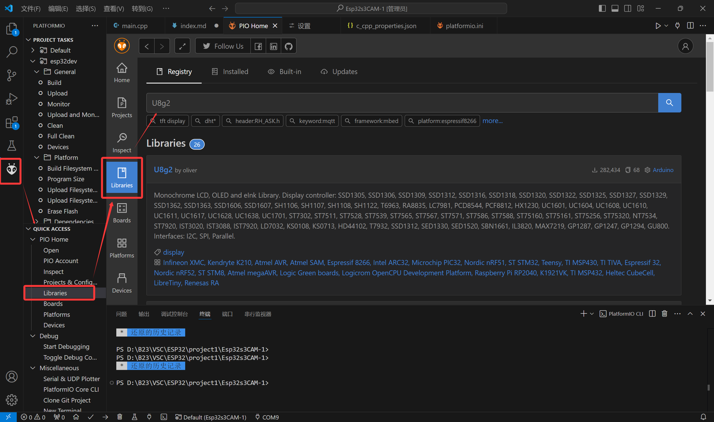
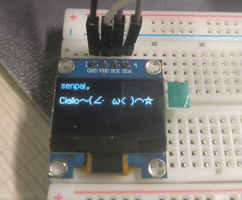

## 前言

七毛九淘宝买了块0.96寸的1315驱动的OLED显示屏，到货焊接四根针脚：`GND、VDD、SCK、SDA`，由此得知这块屏幕走的是i2c协议。

全网找了半天都没有在VSCode platformIO 里导入U8g2库的教程（也可能是我搜索的姿势不对），摸索了半天才点亮，所以写一篇教程方便和我一样不清楚的小白查阅。

## 接线

`GND` - `GND`

`VCC` - `3.3V/5V`

`SCK(SCL)` - `自定义口1`

`SDA(MOSI)` - `自定义口2`

## U8g2库的安装

在`VSCode`>`PlatformIO`>`PIO Home`>`Libraries`中搜索`U8g2`:



点击，添加至项目，等待漫长的安装...(因为U8g2是一个兼容多平台的图像库，所以内容很多)

安装好之后可以在你项目文件夹里的

`\.pio\libdeps\esp32dev\U8g2`

找到依赖和示例，至此和Arduino IDE里使用方法一致。

注意，如果你先前还安装过Library里其他的屏幕驱动，需要把它删干净了再编译上传，不然可能会冲突报错= =。

## 点亮

以我手中这块128x64单色OLED屏幕为例：

````cpp
#include <Arduino.h>
#include <U8g2lib.h>

// 自定义的CLK和SDA引脚
#define OLED_CLK  12  
#define OLED_SDA  9
// 构造对象
U8G2_SSD1306_128X64_NONAME_F_SW_I2C OLED(U8G2_R0, OLED_CLK, OLED_SDA, U8X8_PIN_NONE);  // 选择你屏幕的规格，1315也可以用1306的驱动

void setup() {
  // 初始化OLED
  OLED.begin();
  // 开启中文字符集支持
  OLED.enableUTF8Print();
  // 设置字体
  OLED.setFont(u8g2_font_wqy12_t_gb2312);
}

void loop() {
 
  // 清除缓存区内容
  OLED.clearBuffer();
  // 绘制内容
  OLED.setCursor(0, 10);
  OLED.print("Hello, world!");

  OLED.setCursor(0, 30);
  OLED.print("你好,世界!");

  // 发送缓存区内容到OLED
  OLED.sendBuffer();

  delay(1000);
}
````

带点私货，点亮：



> Ciallo～(∠・ω< )⌒☆