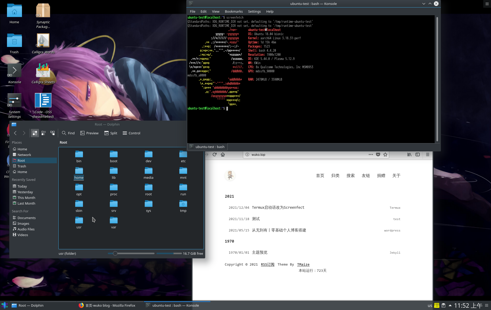
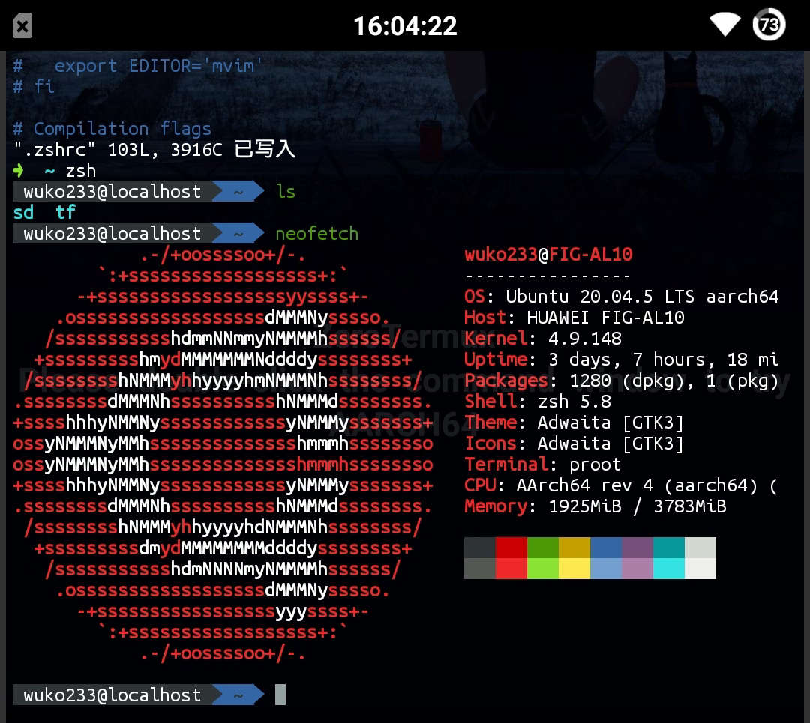
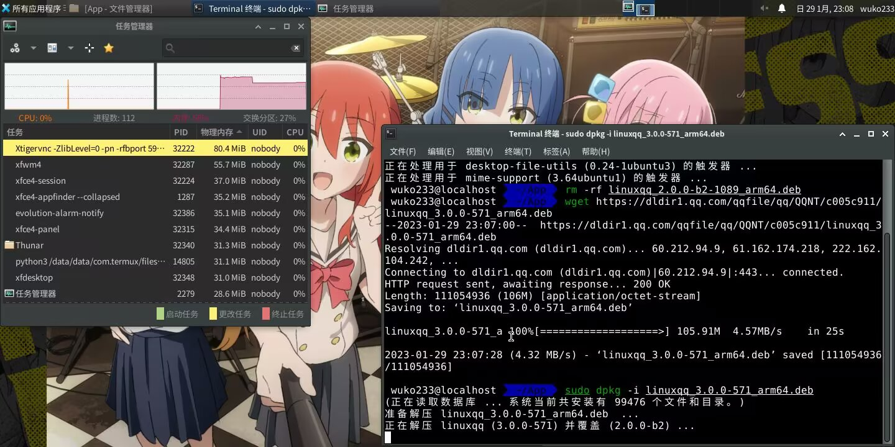
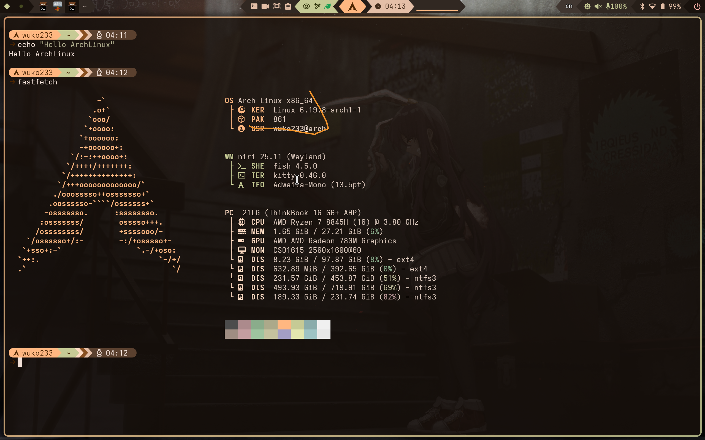
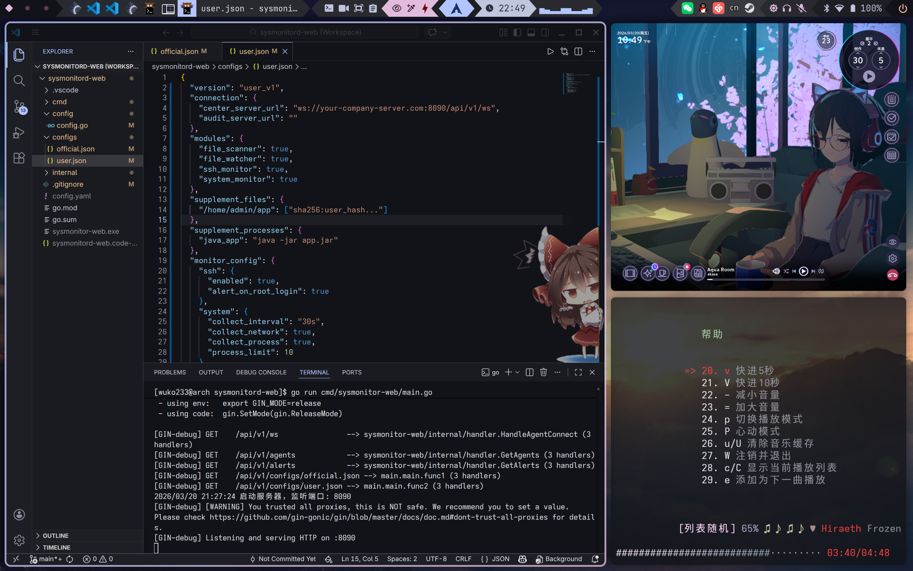
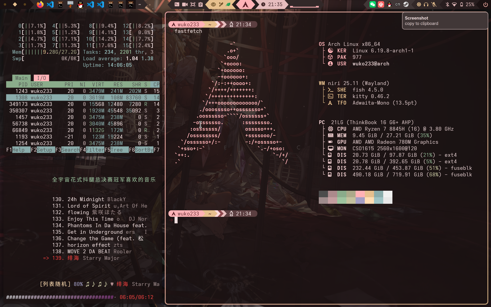

> 本文记录了笔者从初中初次接触 Linux，到最终成功安装 Arch Linux 双系统的完整历程。文章以时间线展开，回顾了 Termux、Ubuntu、Armbian、Debian 等多个发行版的使用经历，重点讲述了笔者因 Windows 系统问题而决心转向 Arch Linux 的过程。安装过程中遇到了 ISO 启动失败、缺少网络工具、硬盘分区识别、双系统引导配置等一系列问题，并分享了解决经验。文章还详细介绍了桌面环境 Niri 的配置、软件安装技巧（如 clash-verge 的安装）、网络优化以及实际使用体验，最后以对 Arch Linux 用户的幽默祝愿收尾。这是一篇既包含技术干货，又充满个人色彩的 Linux 折腾实录。

---

# 前

第一次接触linux，最早还是在初中。当时为了持久化运行`go-cqhttp`(现在已经被制裁了)，试过了安卓的多个终端模拟器，最后选择了广为人知的`Termux`。虽然不用额外安装linux容器也可以直接跑，但是当时毕竟还是更喜欢图形化界面，于是又装了`Ubuntu18.04`，桌面用的`KDE`，用vnc连接。



---

下一次用桌面端Linux，是在22年末，新冠疫情影响，被困亲戚家。没有电脑，只有两台手机，一台骁龙625的vivoX9用于娱乐，一台麒麟659的华为畅享用来上网课（3000毫安五年的衰减，导致这台华为只能插电用，断电了直接60秒关机。有一次线上考试途中手机没电关机了，直接导致了笔者喜提传奇LCD新手机，详见： [Xiaomi XAGA 购机与使用体验](https://blog.wuko.top/posts/2023/02/02/xiaomi-xaga-%E8%B4%AD%E6%9C%BA%E4%B8%8E%E4%BD%BF%E7%94%A8%E4%BD%93%E9%AA%8C.html/)）。


依旧是最熟悉的Ubuntu，不过这次是20.04版本，跑在华为，在vivo用ssh连接，桌面使用`xfce`。



装桌面端的初衷是为了方便编辑文档和表格（但其实并不方便），但是装好以后也没用几次，因为没过几个星期就换了新手机。



也算是第一次把linux当主力了。

---

下一次桌面端Linux就是实体机了。家里的电脑是09年组装的，在笔者为其更新到Win10企业版后出现了因显驱太老旧而不支持某些新特性的问题，于是便想着装个双系统。系统依旧是那个最熟悉的Ubuntu，可能是22.04或者20.04。桌面使用GNOME。

烤录启动盘，分区，安装，一切流程都异常顺利，但是拔出启动盘后却进不了Linux的引导。由于我当时是小白中的小白，于是便不了了之，后来直接整个平台升级了，详见：[第一次捡垃圾装PC&我的电脑历程](https://blog.wuko.top/posts/2024/06/09/pczhuangji.html/)

---

高二高三的时候，捡矿渣捡了一台玩客云，armv7架构的CPU（啥都跑不了），1GB的RAM，8GB的emmc，装了`Armbian`，还塞了什么1Panel、青龙、pma、docker、跑着nginx、MySQL，内网还跑着WordPress，Alist，当然还有go-cqhttp。总之什么有意思就装什么。当然，1g的内存，就没装桌面了。

终于，这个花了笔者50的大矿渣在为我日夜不息中强度工作一年多后，在一次1Panel更新后的重启，emmc成功挂了，直接卡引导了。由于临近高考，所以也没心思修，直到现在还静静躺在柜子里吃灰。

---

再往后就上了大学。经导师介绍帮一个老师开发某些项目并且部署上线，到了才知道原来是从零部署。8代i7withAMD亮机卡，1T大机械，装着32位win7（23333）。先把硬盘格式化了，只装纯命令行的`Debian13`。安装还好，配网才花时间。

校园大内网，想要实现互联网连接，一个方法是以个人身份进行认证，另一个方法是向学校的信管中心申请固定IP+互联网连接。先来说说第一个，笔者学校最便宜的资费为35元30天，带宽只有可怜的10M，还限制3台设备登录，没有IPv6，不知道的以为是20年前的套餐呢。那肯定选后者，经过漫长的逐层审批和流程，终于是得到了IP。但是线下有两台服务器，只有一个网口和一个4口路由器，路由器又得满足老师办公需求不能用，最后从家里拿了个百兆交换机先用着，等了半个月协调来了一个交换机。安装系统只花了两个小时，配网配了快俩月。

---

大一还参加了网安社团，所以第一次接触到了`Kali`这个发行版，安装自带一堆渗透工具，给之前用Debian/Armbian当服务器的我看呆了（Debian装上啥都没有，但是还是我见少了，后面装Arch才知道还能这么少）。当时还用着VMware。

VMware还是太不优雅了，每次启动程序再打开虚拟机，虽然配置了快捷方式可以一键打开虚拟机，但是总觉得体验有点撕裂。后来朋友推荐下知道了HyperV，win自带的虚拟机，配合ExHyperV管理器，使用体验确实要好上不少。

但是体验终究还是差了点，遂尝试`WSL`（Windows Subsystem for Linux），体感非常不错，一键启动，终端和win原生终端一样，并且和win的文件管理是互通的，可以直接拖拽，在虚拟机的话还需要装工具，而且还会时不时出问题。于是便一直用到了上个星期。

# Arch Linux

## 因

起因是因为经常要切换不同窗口打字，基本上每次切换都会触发类似按下Ins键的效果，而且还取消不了，只能切换两次输入法才能恢复正常。本来以为是在老家没有地线导致的干扰，没想到到了学校还是这样，没招了，只能试着更新Windows，更新后问题是解决了，但是一堆莫名其妙的bug出现了，先是开机锁屏pin图标乱飞，锁屏壁纸原生的和自定义的打架，玩游戏经常掉显驱（也可能是AMD的问题，但是更新前很少），还有各种小问题。

再加上最近在开发一个Linux安全应用，使用win WSL开发监测不到一些事件，索性打算直接装个双系统使。

## 一时兴起

就在有这个想法后，我想到了老早前看到过的视频，大概就是什么超好看的Linux桌面配置，里面用的系统就是`Arch Linux`，并且先前实验室的一个学长的笔记本也装着arch，于是便一时兴起决定装Arch Linux，但问题在于当时时间是晚上十点，违反了装机法之不要在晚上装机，这也为后面埋下了伏笔...

先从arch官网下载了一个iso镜像，放到了我之前装机格式化过的VentoryU盘里，随后到win设置里关闭了快速启动（还不能直接关），再到BIOS里关闭了安全启动。

### ISO启动失败

插盘，进ISO，想象中的图形化安装引导界面并没有出现（其实没问题也不会出现，我后面才知道），有的只有一堆报错，`ACPI BIOS Error： AE_ALREADY_EXISTS`和`# INIT NOT FOUND`。咕噜了一下，貌似是因为联想fTPM和AMD平台对某些内核不兼容。跟着教程手动从GRUB启动，找到ISO的挂载位置，直接设置内核并加载：

```sh
linux (hd0,msdos1)/ventoy/arch/boot/x86_64/vmlinuz-linux archisobasedir=arch archisolabel=ARCH_202603 tpm_tis.interrupts=0
initrd (hd0,msdos1)/ventoy/arch/boot/x86_64/initramfs-linux.img
boot
```

### ISO没网洛工具上不了网

成功进到了iso系统里，然后就又发现不对了：

没有有线网连接，只能试着连无线网，试着用`iwctl`，结果居然没有iwctl，好嘛，那就用`nmcil`，啥叫nmcil not found？随后我试了一堆工具，惊讶地发现，这个镜像系统没有无线网络工具...

那就试试USB网络共享呗，插上手机，`IP link`有了usb0，试着用`dhcpcd`获取IP地址，您猜怎么着，dhcpcd也没有。没招了，因为不知道手机USB共享的具体IP地址，按照教程手动`ip`配置网关DNS，怎么都上不了网。

紧急请教dalao，大佬直接扣了个问号，随后直接线下送来了他的镜像U盘，插上才知道，之前过的都是什么苦日子：

iso进不去，是因为我下的精简包，全量安装镜像直接进去没一点问题；没有网络工具，是因为我下的精简包，全量包工具很全，USB共享即插即用。

惨痛的经验教训，不要用时间换空间，一定要下全量包。

于是便借用大佬的镜像盘继续安装，详细步骤参考了：[【萌新向】ArchLinux 2026.1安装教程](https://zhuanlan.zhihu.com/p/1979668742423201303)

### 找不到未分配的盘空间

然后进行分盘，又遇到问题了：

`lsblk`，找不到我预留的500G空间。

我的笔记本有两块硬盘，第一块海力士1T分了两个盘，一个win系统盘，一个数据盘；第二块350元买的致态7100Ti1T(对，就是现在涨到1300元的那个23333)原本是一个整盘，没有分区。为了装Arch Linux，进行了磁盘整理后压缩了500G空间出来。

理论上，`lsblk`会显示两个硬盘，第一个硬盘下面有win的两个区和EFI，而第二个盘应该会显示那一个区和未分配的500G。

一切都和预想中的一样，除了那500G。我用`fdisk -l`也并没有找到那500G的空间。这500G就像是公摊面积一样从我的实际容量里消失了。

我还试着重进了两次ISO，无功而返。最后解决方法是在win里打开`DiskGenius`手动建立了一个500G的分区（Ext4），并且建立了100G和400G的两个逻辑分区（分别为`/`和`/home`准备）。

然后打开ISO系统，终于能识别了。

**在这里，我差点犯下了一个大错，足以毁掉我的整个笔记本系统：**

每次进入Linux时，硬盘的分区名字（设备节点名的顺序）是会变的——上一次还在`/dev/nvme0n1`，下一次启动可能就变`/dev/nvme1n1`了。

而我，并没有每次查看`lsblk`，而是直接沿用了上一次的路径。

所幸，在我挂载硬盘时，因为两个盘的区的序号不同，我在挂载时直接报错了不存在，这才发现了问题：

```sh
before：
> lsblk
nvme0n1
├─nvme0n1p5
└─nvme0n1p6

nvme1n1
├─nvme1n1p1
└─nvme1n1p2

after:
> lsblk
nvme0n1  ← 现在是之前的那块 nvme1n1（没有p5/p6）
└─nvme0n1p1
└─nvme0n1p2

nvme1n1  ← 现在是之前的那块 nvme0n1（有p5/p6）
├─nvme1n1p5
└─nvme1n1p6
```

万幸两块盘数据分区编号不同，我也没有执行格式化，不然直接当场爆炸，数据全丢了。

**————挂载不同硬盘一定要用UUID————**

### 双系统引导与一些建议

```sh
nvme1n1p1 260M vfat WIndows EFI
```

确认Windows的EFI在`nvme1n1p1` ，挂载它为`/mnt/boot/`，进入系统：`arch-chroot /mnt`

就是常规的那些设置，不过双系统需要注意，需要安装`os-prober`，并配置`/etc/default/grub`，添加或取消注释：

```sh
GRUB_DISABLE_OS_PROBER=false
```

再生成配置：

```bash
grub-mkconfig -o /boot/grub/grub.cfg
```

确保Windows系统被添加：

```
Generating grub configuration file ...
Found linux image: /boot/vmlinuz-linux
Found initrd image: /boot/initramfs-linux.img
Found Windows Boot Manager on /dev/nvme0n1p1
Adding boot menu entry for UEFI Firmware Settings ...
done
```

还有一件事，退出ISO系统前，先在chroot里把该装的工具装好，比如`dhcpcd`、`iwd`、`networkmanager`、`vim`等等，它默认安装的是精简镜像（就是上面啥都木有的系统），不然就等着再进一次ISO了= =。

## 舒适化

在经历了以上内容，已经是第二天的凌晨了，宿舍早已断电（11点），没办法，只能第二天再继续配置。

第二天，在配置好该配置的东西后，到了选桌面的环节了！先前已经用过了`KDE`、`xfce`以及`GNOME`，这次肯定要用个没用过的新奇的玩意儿，况且装Arch Linux的一个驱动力也是漂亮的桌面。那肯定是时新的`Wayland`了！

`niri`和`hyprland`，这两个窗口管理器之间犹豫了好久，最后选择了`niri`，因为更喜欢rust来着233。

抄的这个大佬的作业：[SHORiN-KiWATA/Shorin-ArchLinux-Guide/](https://github.com/SHORiN-KiWATA/Shorin-ArchLinux-Guide/)


配置好后是这样子滴：



---

窗口管理器: `Niri` (滚动式 Wayland 合成器)

任务栏: `Waybar`

终端: `Kitty`

应用启动器: `Fuzzel`

输入法: `Fcitx5`

壁纸管理: `Waypaper` + `Swww`

锁屏: `Hyprlock`

通知: `Mako`

剪贴板: `Cliphist` + `Shorinclip`

### 刷新率

默认niri刷新率只有60fps，需要手动改一下，先查看现在支持的分辨率：

```sh
> niri msg outputs
Output "California Institute of Technology 0x1615 Unknown" (eDP-1)
  Current mode: 2560x1600 @ 60.002 Hz
  Variable refresh rate: supported, disabled
  Physical size: 340x220 mm
  Logical position: 0, 0
  Logical size: 1706x1066
  Scale: 1.5
  Transform: normal
  Available modes:
    2560x1600@60.002 (current)
    2560x1600@120.002
    1920x1200@60.002
    1920x1080@60.002
    1600x1200@60.002
    1680x1050@60.002
    1280x1024@60.002
    1440x900@60.002
    1280x800@60.002
    1280x720@60.002
    1024x768@60.002
    800x600@60.002
    640x480@60.002

```

任意editor打开`~/.config/niri/config.kdl`，把output改成你想要的分辨率和帧率。

因为我的`output`是用include从`output.config`导入的，所以修改它就可以了：

```
› cat .config/niri/output.kdl 
output "eDP-1" {
    mode "2560x1600@120.002"
    scale 1.5
}
```

注意，帧率必须要和`niri msg outputs`的输出保持一致，比如我的配置改成120就会报错。

### 网络

我这次用的shell是`fish`，fish支持一个很实用的功能，函数：

```sh
function update-github520
    echo "正在更新 GitHub520 hosts..."
    sudo sed -i "/# GitHub520 Host Start/,/# GitHub520 Host End/d" /etc/hosts
    curl https://raw.hellogithub.com/hosts | sudo tee -a /etc/hosts > /dev/null
    echo "✅ 更新完成！"
end
```

如上实现了Github的快速更新host，只需要写入`~/.config/fish/config.fish`就可以！或者直接在终端输入这些，然后发送`funcsave update-github520`就可以自动保存！

照猫画虎，我还创建了例如快速绕过校园网登录之类的快速命令，很舒服~

---

**艰难的代理软件配置之路**

先试着装`clash-verge`，AUR好慢，时间越来越长。。。

遂尝试配置`Hiddfy`，下载appimage，打不开，显示缺少GL，以为是显驱有问题，又把openGL和Vulkan的AMD驱动重装了一遍，还是打不开。怀疑是软件问题，于是去OSU!官网下了个Lazer的Appimage，结果顺利打开了，而且延迟比Win还低。。

于是继续回到`clash-verge`，放弃AUR安装，dalao提醒可以通过deb包安装，遂尝试。

下载安装`debtap`:

```sh
# 安装 debtap
yay -S debtap
```

没错，还是AUR，但是好歹这个没有那么慢。。。

安装完后更新debtap数据库：

```sh
# 更新 debtap 数据库
sudo debtap -u
```

您猜怎么着，又卡住了，还是连接缓慢。。。

但是debtap的话国内是有镜像源的！

直接换源：

```sh
# 把 Debian 的源替换为中科大源
sudo sed -i "s|http://ftp.debian.org/debian/dists|https://mirrors.ustc.edu.cn/debian/dists|g" /usr/bin/debtap

# 把 Ubuntu 的源替换为中科大源
sudo sed -i "s|http://archive.ubuntu.com/ubuntu/dists|https://mirrors.ustc.edu.cn/ubuntu/dists|g" /usr/bin/debtap
```

再次运行，成功更新！

转换deb包：

```sh
debtap -q clash-verge-rev_2.4.6_amd64.deb
```

安装转换后的包：

```sh
sudo pacman -U clash-verge-rev*.pkg.tar.zst
```

但是，事情会有这么简单吗：

```sh
> sudo pacman -U ./clash-verge-2.4.6-1-x86_64.pkg.tar.zst
正在加载软件包...
正在解析依赖关系...
警告：无法解决 "gtk"，"clash-verge" 的一个依赖关系
:: 因为无法解决依赖关系，以下软件包无法进行更新：
      clash-verge
```

因为Arch和Debian/Ubuntu的依赖名字不一样（gtk3与ggtk），所以报错了。。

现在就只有手动修改依赖文件了：

```sh
# 创建一个临时工作目录
mkdir ~/clash-verge-fix
cd ~/clash-verge-fix

# 解压你转换好的包
tar -xzf ~/Downloads/clash-verge-2.4.6-1-x86_64.pkg.tar.zst

# 编辑 .PKGINFO 文件，把依赖的 "gtk" 改成 "gtk3"
nano .PKGINFO
# 找到类似 depend = gtk 的行，改成 depend = gtk3

# 重新打包
tar -czf clash-verge-fixed.pkg.tar.zst ./*
```

好麻烦，有没有更简单的步骤呢？有的兄弟，有的：

```sh
debtap clash-verge-rev_2.4.6_amd64.deb

==> Extracting package data...
==> Fixing possible directories structure differencies...
==> Generating .PKGINFO file...

:: Enter Packager name (can be left blank):


:: Enter package license (can be left blank, you can enter multiple licenses comma separated):


*** Creation of .PKGINFO file in progress. It may take a few minutes, please wait...

==> Checking and generating .INSTALL file (if necessary)...

:: If you want to edit .PKGINFO and .INSTALL files (in this order), press (1) For vi (2) For nano (3) For default editor (4) For a custom editor or any other key to continue: 
```

去掉`-q`参数，它就会询问你是否要编辑`.PKGINFO`，直接在这步使用`vi`或者`nano`编辑，去掉`gtk`就大功告成了！

然后在运行安装就成功了！

### Flatpak

查看当前源:

```sh
flatpak remotes --show-details
```

配置上交镜像：

```sh
sudo flatpak remote-modify flathub --url=https://mirror.sjtu.edu.cn/flathub
```

---

**Flatpak踩坑点**

需要读取外部文件作为依赖的软件别用flatpak安装，比如`vscode`或`OSS`，会有权限问题。

使用Flatpak安装的QQ打开就要禁止自动更新，不然会因为QQ 内置的自动更新机制与 Flatpak 的沙盒环境冲突，直接白屏。


### 网易云

个人感觉`go-musicfox`完全够用，而且应该不会被冻结号（之前用`YesPlayMusic`账号会被警告）：

```sh
yay -S go-musicfox
```

就是需要一定的学习成本，可以在TUI里按`?`查看命令。

### Cherry Studio

原来这个居然支持Linux，之前不知道还装了`OpenWebUI`:

[Cherry-Studio-x86_64.AppImage](https://www.cherry-ai.com/)

### AppImageLauncher

自动处理AppImage，双击即运行、一键创建菜单图标、统一管理，它还提供右键菜单，可以直接更新或卸载已集成的 AppImage，非常方便:

```sh
yay -S appimagelauncher
```

### Steam双系统导入库

安装还好，配置好网络就行。

关键在于如何导入win的游戏。

首先先挂载你的win盘到Linux：

```sh

UUID=6CDEDCC1DEDC852C /run/media/wuko233/Data lowntfs-3g defaults,uid=1000,gid=1000,rw,user,exec,auto,allow_other,big_writes,windows_names,umask=000 0 0

UUID=C59EA99716BFB733 /run/media/wuko233/C59EA99716BFB733 lowntfs-3g defaults,uid=1000,gid=1000,rw,user,exec,big_writes,windows_names,umask=000 0 0
```

**!!!请使用UUID挂载!!!**

然后在你的Steam设置，存储空间里导入库，库的地址必须是到`steamapps`的上级，也就是Steam的安装位置。

### 双系统时差问题

win的时间是将BIOS时间当作本地时间，而Linux则是当作UTC（Coordinated Universal Time），这就导致了Linux时间会快8个小时，而你在Linux校准时间后，Win的时间就会慢8个小时。。。

解决：

让Linux使用本地时间：

```sh
timedatectl set-local-rtc 1 --adjust-system-clock
```

当然，你也可以通过更改Windows的注册表，让Win使用UTC，但是感觉还是Linux改比较方便。

## 体验



已经高强度用了一周了，总体来说，很舒服。除了浏览器这类的，基本上手可以一直保持在键盘上，像在写这篇博文时我就基本没用鼠标。

开发的话，体验也比Windows要好，终于理解那些用Mac写代码的人了：浑然一体，之类的？

动画比Windows好太多了，虽然还需要适应操作逻辑，但感觉适应了之后效率应该会更高。

中文输入法能用就行，中文分词没有，等之后想办法解决了再加进来，当前有点难受。某些X11应用输不了中文，待解决。。。

游戏差强人意，能玩，但是像一些挂机游戏没适配Wayland就很难受...~~OSU!Lazer夯爆了，不但完美适配，还能直接导入win的游戏数据。~~

最满意的地方就是它的占用、功耗和静音了。以当前写文档环境为例：

浏览器五六个标签页，三个vscode页面，一个网易云cil，一个steam，qq微信，Cherry Studio

占用内存`9.33GB`，100电量用到20花了5个半小时，功耗基本上都在13w左右徘徊。

安静是真安静，因为风扇压根不转，刚装上还以为是风扇驱动有问题2333。

办公的话，还是用win吧，特指文档表格那些，LibreOffice之前用过，只能说勉强能用，WPS Office，不适配高分屏，要么小模块要么高糊屏。最主要是预览和win预览效果完全不一样，为了迎合大部分人的格式，还是用windows吧。。

# 末



- 愿 `pacman -Syu` 永远不冲突，依赖永远完美解决
- 愿 AUR 里的每个 PKGBUILD 都干净利落，无需手动改
- 愿 GRUB 每次 `mkconfig` 都能精准找到内核
- 愿 `initramfs` 永远完整，不掉驱动
- 愿 `systemd-boot` 的 entry 永远正确

- 愿显卡驱动永不撕裂，NVIDIA 和 Wayland 和谐共处 （@ks_lm_kf）
- 愿 Wi-Fi 每次开机自动连上，不抢在 dhcpcd 前面
- 愿蓝牙设备秒连，不出现「br-connection-page-timeout」
- 愿休眠唤醒后一切正常，声卡不消失，触控板不抽风

- 愿 `sudo` 永远记得你的密码，不会在关键时刻说你不在 sudoers 里
- 愿 `/etc` 里的每个备份都刚好在改崩之前
- 愿 `arch-chroot` 用的那根 U 盘永远在你手边
- 愿论坛的 Arch Wiki 永远能打开，且你刚好搜到对的条目

最后再加一句——
**「愿 Rolling Release 永远丝滑，你永远不需要回滚。」**

祝你 Arch 之路，一滚不挂，一启就亮。🚀